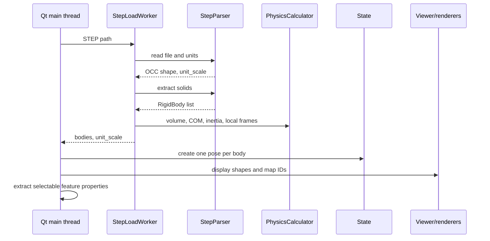
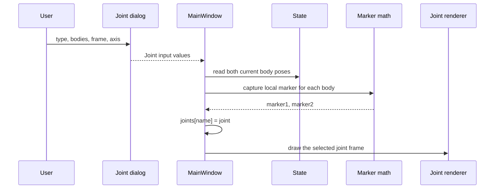
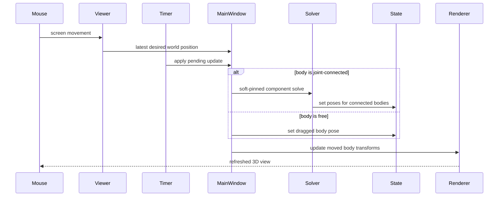

# MBD Pre-Processor Architecture

This document explains how the repository turns a static STEP assembly into an editable multi-body model. It follows the data from the CAD file, through geometry and physical-property extraction, into frames, joints, loads, body poses, the kinematic solver, the 3D view, and finally the exported files.

The application is a **pre-processor**, not a dynamics simulator. It prepares geometry and model definitions and contains a position-level kinematic assembly solver. It does not integrate equations of motion, calculate accelerations, detect contact, or apply forces and motors to simulate time.

## 1. Architecture at a glance

```mermaid
flowchart LR
    STEP["STEP file<br/>CAD coordinates"] --> Worker["STEP load worker"]
    Worker --> Parser["STEP parser<br/>shape + unit scale"]
    Parser --> Bodies["RigidBody objects<br/>OpenCASCADE shapes"]
    Bodies --> Physics["Physical-property calculator"]
    Physics --> Domain["Domain model<br/>bodies, COM, inertia, frames"]

    User["User input"] --> UI["MainWindow + Qt panels"]
    UI --> Selection["OCC selection<br/>body / face / edge / vertex"]
    Selection --> Features["Geometry properties"]
    Features --> Frames["Reference frames"]
    Frames --> Definitions["Joints, forces, torques, motors"]

    Domain --> State["State<br/>current world poses"]
    Definitions --> Solver["Kinematic solver"]
    State <--> Solver

    Domain --> Renderers["Visualization adapters"]
    Frames --> Renderers
    Definitions --> Renderers
    State --> Renderers
    Renderers --> Viewer["OpenCASCADE 3D viewer"]
    Viewer --> User

    Domain --> Exporter["Assembly exporter"]
    Frames --> Exporter
    Definitions --> Exporter
    Exporter --> Output["JSON + OBJ meshes"]
```



The central design rule is:

> CAD shapes remain unchanged. A body's current placement is stored separately in `State`, and the renderer applies the difference between the imported placement and the current placement.

This separation makes dragging and constraint solving reversible and avoids repeatedly modifying expensive boundary-representation geometry.

## 2. System map

| System | Responsibility | Main input | Main output | Source |
|---|---|---|---|---|
| Application coordinator | Owns collections, connects Qt signals, starts workflows | User commands and worker results | Calls into every other system | [`MainWindow`](../main.py#L127) |
| STEP import | Reads the file, discovers units, extracts solids | `.step` or `.stp` path | OCC shape, metres-per-model-unit scale, bodies | [`StepParser`](../core/step_parser.py#L14) |
| Physical properties | Calculates volume, centre of mass, inertia and initial body frames | OCC body shapes and unit scale | SI-valued properties on each `RigidBody` | [`PhysicsCalculator`](../core/physics_calculator.py#L13) |
| Geometry features | Describes selectable faces, edges and vertices | OCC body shape | Centres, normals, lengths, directions and coordinates | [`geometry_utils.py`](../core/geometry_utils.py) |
| Domain model | Stores bodies, frames, joints, loads, motors and poses | Import and user-created definitions | Shared Python objects | [`data_structures.py`](../core/data_structures.py) |
| Interaction | Converts mouse and panel actions into selections and drag targets | Screen events and OCC picks | Body/feature IDs and desired world positions | [`SelectableViewer3d`](../gui/viewer_3d.py#L22) |
| Kinematics | Finds body poses that satisfy joints | Joints, markers, current `State`, optional drag target | Updated body poses and `SolveReport` | [`core/kinematics`](../core/kinematics) |
| Visualization | Converts domain values into OCC interactive objects | Shapes, frames, loads and current poses | Displayed AIS objects and local transforms | [`visualization`](../visualization) |
| Export | Serializes model data and triangulates body shapes | Bodies, joints, frames and unit scale | Assembly JSON and COM-centred OBJ files | [`AssemblyExporter`](../export/exporter.py#L25) |
| Project persistence | Stores enough editing data to reopen a project | STEP path, frames and joints | `.mbdp` JSON | [`save_project`](../main.py#L2156), [`load_project`](../main.py#L2228) |

## 3. Repository layout

```text
MBD-PreProcessor/
├── main.py                         application entry point and coordinator
├── core/
│   ├── data_structures.py          domain objects and mutable pose state
│   ├── step_parser.py              STEP loading, units and solid extraction
│   ├── physics_calculator.py       volume, COM and inertia
│   ├── geometry_utils.py           selected feature properties and frames
│   └── kinematics/
│       ├── markers.py              rigid-transform and rotation math
│       ├── graph.py                connected body groups
│       ├── constraints.py          joint residuals and Jacobians
│       └── solver.py               damped least-squares solve
├── gui/
│   ├── viewer_3d.py                picking, camera controls and drag targets
│   ├── body_tree_widget.py         model tree and delete/isolate actions
│   ├── property_panel.py           selected-item properties
│   └── *_dialog.py                 joint, force, torque and motor input
├── visualization/
│   └── *_renderer.py               domain-to-OpenCASCADE adapters
├── export/
│   └── exporter.py                 JSON and OBJ output
└── tests/                           headless and OCC-backed regression tests
```

## 4. The data model and its coordinate systems

The most important types are defined in [`core/data_structures.py`](../core/data_structures.py).

### 4.1 Main objects

| Type | Meaning | Important fields |
|---|---|---|
| `RigidBody` | One solid extracted from the STEP assembly | `id`, `shape`, `volume`, `center_of_mass`, `inertia_tensor`, `local_frame`, `state` |
| `Frame` | An origin and three oriented axes | `origin`, `rotation_matrix`, `name` |
| `Pose` | A body's current six-degree-of-freedom placement | `origin`, `rotation_matrix` |
| `State` | Mutable store for all live body poses | `body_poses[body_id]` |
| `Joint` | Allowed relative motion between two bodies | body IDs, type, axis, world frame, two body-local markers |
| `Force` | External force definition | body ID, application frame, magnitude, unit direction |
| `Torque` | External moment definition | body ID, reference frame, magnitude, unit axis |
| Motor fields on `Joint` | Intended joint actuation | motor type and target value |

`RigidBody.shape` is an OpenCASCADE `TopoDS_Shape`. This is the high-detail CAD representation used for selection, display, property calculation and meshing. `RigidBody.state` is only a reference to the shared `State`; the live pose is not duplicated inside each body.

Although [`Assembly`](../core/data_structures.py#L189) defines a possible aggregate object, the current application does not use it as the runtime owner. `MainWindow` directly owns `bodies`, `joints`, `created_frames`, `forces`, `torques` and `assembly_state`. New features must therefore be wired into the coordinator's creation, deletion, clearing, display and serialization paths.

The pose write path is deliberately small:

```python
class State:
    def __init__(self):
        self.assembly_pose: Pose = Pose()
        self.body_poses: Dict[int, Pose] = {}

    def set_body_pose(self, body_id: int, origin: np.ndarray,
                      rotation_matrix: np.ndarray):
        self.body_poses[body_id] = Pose(origin, rotation_matrix)
```

See [`State`](../core/data_structures.py#L317) and [`RigidBody.get_world_position`](../core/data_structures.py#L404).

### 4.2 Coordinate spaces

The code works in several coordinate spaces. Mixing them is a common source of errors.

| Space | Unit | Used by |
|---|---|---|
| Imported CAD/model space | Unit declared by the STEP file | OCC shapes and topology |
| Domain world space | metres | COM, `Frame.origin`, `Pose.origin`, solver positions |
| Orientation space | dimensionless 3×3 rotation matrix | Frames, poses and joint markers |
| Body marker space | metres relative to the body's pose | `Joint.marker1` and `Joint.marker2` |
| Viewer transform space | original model units | OCC `gp_Trsf` translations |
| OBJ body-local space | metres, centred on COM | Exported mesh vertices |

`unit_scale` means **metres per model unit**. A millimetre STEP file therefore has `unit_scale = 0.001`. Domain positions are multiplied by this scale on import. Renderer translations are divided by it when converted back to OCC model units.

`State.assembly_pose` exists as a potential root transform but is not used by the current interaction, solver or renderer flows; live placement is carried by the per-body entries.

### 4.3 Geometry, initial frame and live pose

These values look similar but have different jobs:

- The OCC `shape` contains the imported geometry at its original placement.
- `center_of_mass` is calculated from that imported geometry and stored in metres.
- `local_frame` is initialized at the COM with world-aligned axes.
- The first `Pose` in `State` is copied from `local_frame`.
- Later drag or solve operations update `State`.
- `BodyRenderer` remembers the first pose and applies only the pose difference to the unchanged shape.

The current code also copies solved or dragged poses back into `body.local_frame` for UI convenience. Code that needs the live body placement should nevertheless prefer `State`, because that is the solver and renderer's shared source.

## 5. STEP import system

### 5.1 Loading is split across two threads

`MainWindow.load_step_file()` clears the old model and starts [`StepLoadWorker`](../main.py#L83). The worker performs operations that may be slow:

```python
shape, unit_scale = StepParser.load_step_file(self.filepath)
bodies = StepParser.extract_bodies_from_compound(shape)
PhysicsCalculator.calculate_volumes_for_bodies(bodies, unit_scale)
PhysicsCalculator.calculate_centers_of_mass_for_bodies(bodies, unit_scale)
PhysicsCalculator.calculate_inertia_tensors_for_bodies(bodies, unit_scale)
PhysicsCalculator.initialize_local_frames(bodies)
self.result.emit(bodies, unit_scale)
```

This code is in [`StepLoadWorker.run`](../main.py#L95). It does not create or modify viewer objects. The result signal returns to the Qt main thread, where [`on_load_result`](../main.py#L527) creates `State`, attaches it to each body and displays the shapes.



### 5.2 Unit discovery and solid extraction

[`StepParser.load_step_file`](../core/step_parser.py#L18) asks the STEP reader for the declared length unit and maps metre, millimetre, centimetre, inch and foot names to SI scale factors. Unknown declarations currently fall back to `1.0`.

[`extract_bodies_from_compound`](../core/step_parser.py#L113) walks every `TopAbs_SOLID` and creates one `RigidBody` per solid, with sequential IDs starting at zero. If the imported shape contains no discoverable solid but is non-null, the complete shape becomes `Body_0`.

This means a "body" currently follows STEP solid topology. Product names, assembly hierarchy and CAD occurrence metadata are not preserved.

### 5.3 Main-thread completion

After the worker returns, the coordinator:

1. stores the unit scale;
2. initializes each body pose from its COM frame;
3. displays each OCC shape;
4. extracts all face, edge and vertex properties;
5. creates body-ID-to-AIS mappings used by picking;
6. measures the assembly bounding box to size frame axes and load symbols.

See [`on_load_result`](../main.py#L527) and [`_finish_step_load`](../main.py#L577).

## 6. Geometry and reference-frame system

Faces, edges and vertices are not separate domain entities. They are indexed features of a body shape and are described by:

- [`FaceProperties`](../core/geometry_utils.py#L21): surface area, area centre and normal;
- [`EdgeProperties`](../core/geometry_utils.py#L155): true length, feature centre and direction;
- [`VertexProperties`](../core/geometry_utils.py#L115): point coordinates.

All reported locations and lengths are converted to metres.

### 6.1 How frames are created

A selected feature can become a named `Frame`:

| Feature | Frame origin | Frame Z axis | Frame X/Y axes |
|---|---|---|---|
| Face | Surface area centre | Face normal | Global X projected into the face plane; Y completes a right-handed basis |
| Circle or ellipse edge | Geometric centre | Curve plane normal | Same projection rule |
| Line edge | Length centre | Line direction | Same projection rule |
| Other edge | Length centroid | Chord or tangent fallback | Same projection rule |
| Vertex | Vertex point | Global Z | Identity/world-aligned axes |

For a face, the basis construction is:

```python
z_axis = face_props.normal / np.linalg.norm(face_props.normal)
target_x = np.array([1.0, 0.0, 0.0])
x_axis = target_x - np.dot(target_x, z_axis) * z_axis
x_axis = x_axis / np.linalg.norm(x_axis)
y_axis = np.cross(z_axis, x_axis)
rotation = np.column_stack((x_axis, y_axis, z_axis))
```

The implementation also changes the reference axis when Z is almost parallel to global X. See [`frame_from_face`](../core/geometry_utils.py#L453) and [`frame_from_edge`](../core/geometry_utils.py#L499).

### 6.2 Body-attached frame flow

Feature frames are stored in the imported body's geometry space, with metre-valued origins. `MainWindow.frame_to_body_map` records which body owns each created frame. During rendering, the frame receives the same OCC local transformation as its body.

```text
selected (body_id, feature_index)
    -> cached feature properties
    -> GeometryUtils.frame_from_*
    -> created_frames[frame_name]
    -> frame_to_body_map[frame_name] = body_id
    -> FrameRenderer with the body's AIS local transform
```

The creation paths are [`on_create_frame_from_face`](../main.py#L1095), [`on_create_frame_from_edge`](../main.py#L1135) and [`on_create_frame_from_vertex`](../main.py#L1168). Synchronization after movement happens in [`_sync_body_attached_frames`](../main.py#L1211).

These frames are the bridge between CAD features and model definitions: joint locations, force application points and torque reference points are selected from the available frames.

## 7. Joint and marker system

The implemented joint types are:

| Joint type | Allowed relative motion | Ideal mobility between two bodies |
|---|---|---:|
| `FIXED` | None | 0 |
| `REVOLUTE` | Rotation about one axis | 1 |
| `PRISMATIC` | Translation along one axis | 1 |
| `CYLINDRICAL` | Translation and rotation along/about one axis | 2 |
| `SPHERICAL` | Rotation about a common point | 3 |

The enum is defined in [`JointType`](../core/data_structures.py#L15). Universal and planar joints are not implemented in the current domain model or solver.

### 7.1 Why a joint has two markers

The user chooses one world-space joint frame, but a constraint must continue to move with both bodies. At joint creation, the chosen frame \(J\) is converted into one local marker for each body:

\[
M_i = T_i^{-1}J
\]

where \(T_i\) is body \(i\)'s current world pose. During a solve, the marker is reconstructed in world space:

\[
P_i = T_iM_i
\]

The constraint compares \(P_1\) and \(P_2\), not the original display frame.

```python
def capture_joint_markers(joint, body1_pose, body2_pose):
    joint.marker1 = markers.capture_marker(
        joint.frame, body1_pose[0], body1_pose[1])
    joint.marker2 = markers.capture_marker(
        joint.frame, body2_pose[0], body2_pose[1])
    return joint
```

See [`capture_joint_markers`](../core/kinematics/__init__.py#L20), [`capture_marker`](../core/kinematics/markers.py#L162) and the creation call in [`MainWindow.create_joint`](../main.py#L1559).

Ground is represented by body ID `-1` and is assigned the world frame. It has a pose but no solver unknowns.

### 7.2 Joint creation data flow



Marker capture freezes the relationship that exists at creation time. The solver does not infer CAD mates or search for matching surfaces later.

## 8. Kinematic solver

The solver changes positions and orientations so that joint equations are as close to zero as possible. It is a **position-level** solver: mass, inertia, forces, torques, motors and time are not part of its equations.

The package depends on NumPy and the domain structures but not Qt or OpenCASCADE, which allows the main solver tests to run headlessly.

### 8.1 Solver modules

| Module | Role |
|---|---|
| [`markers.py`](../core/kinematics/markers.py) | Rigid pose composition/inversion, marker transforms, rotation exponential/logarithm |
| [`graph.py`](../core/kinematics/graph.py) | Splits the joint network into connected body groups |
| [`constraints.py`](../core/kinematics/constraints.py) | Calculates each joint's error vector and analytic derivative |
| [`solver.py`](../core/kinematics/solver.py) | Builds the global system, iterates, updates `State`, reports convergence and mobility |

### 8.2 Pose update mathematics

Each movable body contributes six temporary unknowns per iteration:

\[
\delta =
\begin{bmatrix}
\Delta p_x & \Delta p_y & \Delta p_z &
\Delta\omega_x & \Delta\omega_y & \Delta\omega_z
\end{bmatrix}^T
\]

Translation is added in the world frame. Rotation is updated with the exponential map:

\[
p_{\text{new}} = p + \Delta p
\]

\[
R_{\text{new}} = \exp([\Delta\omega]_\times)R
\]

where \([v]_\times\) is the skew-symmetric matrix that performs a cross product. [`exp_so3`](../core/kinematics/markers.py#L68) uses Rodrigues' formula and a small-angle approximation. [`project_to_so3`](../core/kinematics/markers.py#L114) uses singular-value decomposition to remove numerical drift before a rotation is written back to `State`.

### 8.3 Constraint equations

Let \(o_1,o_2\) be the two marker origins in world space, \(R_1,R_2\) their rotations, and \(a_1,a_2\) the chosen joint axis transformed by each marker.

| Joint | Error vector driven toward zero | Physical meaning |
|---|---|---|
| Fixed | \([o_1-o_2,\ \log(R_2R_1^T)]\) | Same point and same orientation |
| Revolute | \([o_1-o_2,\ a_1\times a_2]\) | Same point and parallel axes |
| Prismatic | \([a_1\times(o_2-o_1),\ \log(R_2R_1^T)]\) | Same line and locked relative orientation |
| Cylindrical | \([a_1\times(o_2-o_1),\ a_1\times a_2]\) | Same line and parallel axes |
| Spherical | \(o_1-o_2\) | Same point |

The direct implementation is in [`JointConstraint.residual`](../core/kinematics/constraints.py#L167):

```python
if jt == JointType.REVOLUTE:
    r_pos = o1 - o2
    r_ax = np.cross(a1, a2)
    return np.concatenate([r_pos, r_ax])

if jt == JointType.PRISMATIC:
    r_line = np.cross(a1, o2 - o1)
    r_rot = M.relative_rotation_vector(R1, R2)
    return np.concatenate([r_line, r_rot])
```

Some three-component cross-product errors have only two independent components. Therefore the number of rows is not the true number of restrictions. The solver uses the numerical rank of the full derivative matrix to estimate mobility.

### 8.4 Analytic derivatives

The solver calculates how each error changes for a small body movement. Two building blocks are:

\[
\frac{\partial p_\text{world}}{\partial \delta}
=
\begin{bmatrix}
I & -[p_\text{world}-p_\text{body}]_\times
\end{bmatrix}
\]

\[
\frac{\partial d_\text{world}}{\partial \delta}
=
\begin{bmatrix}
0 & -[d_\text{world}]_\times
\end{bmatrix}
\]

These formulas are implemented in [`_point_jac`](../core/kinematics/constraints.py#L116) and [`_dir_jac`](../core/kinematics/constraints.py#L129). The remainder of [`JointConstraint.jacobian`](../core/kinematics/constraints.py#L202) applies the product rule to the joint equations.

Analytic derivatives avoid repeated extra evaluations during interactive dragging. [`test_jacobian_finite_difference`](../tests/test_kinematics.py#L202) checks them against central finite differences.

### 8.5 Connected components

[`JointGraph`](../core/kinematics/graph.py#L22) treats bodies as nodes and joints as edges. It uses union-find to create independent connected components.

- `solve_assembly()` solves every component containing joints.
- `solve_drag(body_id, ...)` solves only the component containing the dragged body.
- Unconnected bodies are moved directly and unrelated mechanisms are left unchanged.
- A component containing body `-1` is connected to ground.

This graph step makes behavior easier to predict and keeps small edits from unnecessarily solving the entire model.

### 8.6 Damped least-squares iteration

All joint errors are stacked into \(r\), and their derivatives are stacked into \(J\). The code solves a damped normal equation:

\[
\left(J^TJ+\lambda\,\mathrm{diag}(J^TJ)\right)\delta=-J^Tr
\]

```python
JTJ = J.T @ J
g = J.T @ r
diag = np.diag(JTJ).copy()
delta = np.linalg.solve(
    JTJ + lam * np.diag(diag),
    -g,
)
```

See [`KinematicSolver._solve_lm`](../core/kinematics/solver.py#L122). A successful trial halves the damping value; a worse trial restores the previous poses and increases damping. The final poses are written through `State.set_body_pose`.

Joint errors are multiplied by `1000` by default. A drag target is added with the square root of its `pin_weight`. This makes the joints effectively hard and the mouse position soft: if the cursor asks for an impossible position, the mechanism stays close to its valid motion and approaches the nearest reachable position.

### 8.7 Assembly solve and drag solve

`MainWindow.solve_assembly()` calls:

```python
report = solver.solve_assembly(
    max_iters=80,
    tol=1e-9,
    analyze=True,
)
```

The command is available as **Assembly → Solve Assembly** or `Ctrl+K`; see [`solve_assembly`](../main.py#L1657).

During a drag, the 16 ms UI timer calls:

```python
rep = solver.solve_drag(
    body_id,
    new_pos,
    current_rot,
    pin_weight=1.0,
    max_iters=12,
    tol=1e-6,
    pin_orientation=False,
)
```

Only position is pinned because the current mouse gesture translates in the camera plane. See [`_apply_pending_drag_update`](../main.py#L724).

### 8.8 Solver report

[`SolveReport`](../core/kinematics/solver.py#L37) contains:

- convergence status and iteration count;
- total and maximum joint error;
- one error norm per joint;
- IDs of bodies touched by the solve;
- estimated remaining degrees of freedom;
- potentially redundant joints.

The degree-of-freedom estimate is:

\[
\mathrm{DOF}=6n_\text{movable}-\mathrm{rank}(J)
\]

Redundancy is estimated by removing one joint's rows at a time. If removal does not lower the matrix rank, that joint is reported as redundant. This is a numerical diagnostic, not a symbolic proof.

## 9. Interaction and visualization

### 9.1 Input flow

[`SelectableViewer3d`](../gui/viewer_3d.py#L22) owns the low-level viewer interaction:

| Input | Result |
|---|---|
| Click in Body mode | Select a whole body |
| Click in Face/Edge/Vertex mode | Return the selected sub-shape index |
| Left drag on the already selected body | Translate that body or its connected mechanism |
| Left drag elsewhere | Pan |
| Right drag | Orbit |
| Middle drag | Pan |
| Wheel | Zoom |

OCC selection returns an interactive shape or sub-shape owner. Viewer mappings translate that object back to a `body_id`, and topology traversal translates a selected sub-shape into a stable per-load index. See [`_select_at_position`](../gui/viewer_3d.py#L311).

### 9.2 Mouse pixels to a desired body position

The drag code builds camera-plane right and up vectors from the current view direction. Pixel motion is scaled using the current view size:

\[
\Delta p \approx s_\text{pixel}
\left(\Delta x\,\hat{r}-\Delta y\,\hat{u}\right)
\]

The result is a desired world-space COM position. It is not immediately applied on every mouse event. The latest position is queued, tiny changes are ignored, and a 16 ms timer consumes the most recent value. The conversion is in [`_screen_delta_to_world_delta`](../gui/viewer_3d.py#L764); throttling is in [`MainWindow.on_body_drag_move`](../main.py#L683).



### 9.3 Pose-to-view transformation

[`BodyRenderer`](../visualization/body_renderer.py#L15) stores the body's pose when its already-positioned CAD shape is first displayed. For a desired pose \((p_d,R_d)\) and base pose \((p_b,R_b)\), it computes:

\[
R_\Delta=R_dR_b^T
\]

\[
p_\Delta=p_d-R_\Delta p_b
\]

```python
delta_rot = desired.rotation_matrix @ base.rotation_matrix.T
delta_origin = desired.origin - (delta_rot @ base.origin)
trsf = self._pose_to_trsf(delta_origin, delta_rot)
ais_shape.SetLocalTransformation(trsf)
```

See [`update_body_transform`](../visualization/body_renderer.py#L311). Translation is divided by `unit_scale` inside [`_pose_to_trsf`](../visualization/body_renderer.py#L290) because OCC still displays the shape in imported model units.

Face, edge and vertex highlights receive the same local transform. Body-attached user frames are also synchronized. The original `TopoDS_Shape` is not modified.

### 9.4 Renderer responsibilities

| Renderer | Visual output | Important note |
|---|---|---|
| [`BodyRenderer`](../visualization/body_renderer.py) | Shapes, highlight colour and COM marker | Reads live body poses |
| [`FaceRenderer`](../visualization/face_renderer.py), [`EdgeRenderer`](../visualization/edge_renderer.py), [`VertexRenderer`](../visualization/vertex_renderer.py) | Selected feature highlight | Follows the body transform |
| [`FrameRenderer`](../visualization/frame_renderer.py) | RGB coordinate axes | Can receive a body-local OCC transform |
| [`JointRenderer`](../visualization/joint_renderer.py) | Joint frame | Draws `joint.frame`, not a live reconstructed marker |
| [`ForceRenderer`](../visualization/force_renderer.py) | Blue straight arrow | Arrow length is logarithmically scaled for visibility |
| [`TorqueRenderer`](../visualization/torque_renderer.py) | Magenta circular arrow | Radius is logarithmically scaled |
| [`MotorRenderer`](../visualization/motor_renderer.py) | Control-type indicator at the joint | Visual definition only; no time simulation |

The length of a force or torque symbol is a visualization choice and is not a geometrically exact representation of magnitude.

## 10. Physical properties and load mathematics

### 10.1 Uniform-density geometric properties

OpenCASCADE's volume-property routine supplies volume-like mass, centre of mass and central inertia for a uniform solid. The code converts them to SI using the STEP scale \(s\), in metres per model unit.

Volume:

\[
V_\mathrm{m^3}=V_\mathrm{model}\,s^3
\]

Centre of mass:

\[
c_\mathrm{m}=s\,c_\mathrm{model}
\]

Geometric inertia with assumed density \(1\ \mathrm{kg/m^3}\):

\[
I_\mathrm{SI}=I_\mathrm{model}\,s^5
\]

The fifth power appears because mass contributes three powers of length and the squared distance contributes two more.

See [`calculate_volumes_for_bodies`](../core/physics_calculator.py#L49), [`calculate_center_of_mass`](../core/physics_calculator.py#L76) and [`calculate_inertia_tensor`](../core/physics_calculator.py#L134).

The code does not currently store material density. Therefore:

- `volume` is a geometric volume;
- the reported inertia corresponds to unit density;
- a downstream solver using density \(\rho\) should use \(m=\rho V\) and \(I_\rho=\rho I_{\rho=1}\).

### 10.2 Forces and torques

The domain objects normalize the user-provided direction:

\[
\hat{d}=\frac{d}{\lVert d\rVert}, \qquad F=F_\mathrm{mag}\hat{d}
\]

\[
\hat{a}=\frac{a}{\lVert a\rVert}, \qquad \tau=\tau_\mathrm{mag}\hat{a}
\]

Zero directions are rejected. See [`Force`](../core/data_structures.py#L31) and [`Torque`](../core/data_structures.py#L66).

These values are model definitions and viewer annotations. They are not used by the position-level kinematic solver.

### 10.3 Motors

Motors can be attached only to revolute and prismatic joints. Supported control descriptions are:

- velocity: radians/second for revolute, metres/second for prismatic;
- torque/force: newton-metres for revolute, newtons for prismatic;
- position: radians for revolute, metres for prismatic.

The current code stores and renders the motor definition; it does not enforce motor targets in the kinematic solver or advance them over time. See [`Joint.add_motor`](../core/data_structures.py#L142) and [`MotorDialog`](../gui/motor_dialog.py#L12).

## 11. Export and persistence

There are two different serialization paths with different purposes.

### 11.1 Assembly JSON and OBJ export

[`export_assembly_to_json`](../export/exporter.py#L29) writes:

```text
assembly.json
├── metadata
├── ground_body
├── bodies[]
│   ├── id, name, volume, contact_enabled
│   ├── center_of_mass
│   ├── inertia_tensor
│   ├── local_frame
│   └── mesh_file
├── joints[]
│   ├── type, axis, connected body IDs/names
│   ├── motor data, when present
│   └── frame_world
└── frames{}

meshes/
└── <body name>_<id>.obj
```

Each OBJ is tessellated from the unchanged OCC shape. Vertices are scaled to metres and transformed into a COM-centred body frame:

\[
v_\text{local}=R_\text{body}^T(v_\text{world}-c_\text{body})
\]

See [`_export_shape_to_obj`](../export/exporter.py#L285).

Important current boundaries:

- forces and torques are **not** included in assembly JSON;
- live `State.body_poses` are not serialized as a separate field;
- joint-local solver markers are not exported;
- the joint's stored `frame_world` is exported directly;
- `contact_enabled` is metadata only; no contact geometry or contact detection is generated.

Consumers must use the actual schema in [`exporter.py`](../export/exporter.py), not assume every UI object is present.

### 11.2 `.mbdp` project files

Project save is intended to reopen an editing session. Version 1.0 stores:

- absolute STEP file path;
- unit scale;
- created frame names, origins and rotations;
- joint names, types, body IDs, frame values and axes.

It does not currently store:

- body poses;
- frame-to-body ownership;
- forces or torques;
- motor settings;
- visibility/contact choices;
- joint marker values.

Markers are recaptured from the current body poses when possible. Also note that STEP loading is asynchronous while the current restore loop proceeds immediately; project restoration can therefore race the load/reset process. This persistence path should be treated as incomplete until restoration is sequenced after the STEP worker result.

See [`save_project`](../main.py#L2156) and [`load_project`](../main.py#L2228).

## 12. End-to-end workflows

### 12.1 From STEP file to editable assembly

```text
STEP path
  -> StepParser: OCC shape + unit_scale
  -> one RigidBody per solid
  -> PhysicsCalculator: volume + COM + inertia + local frame
  -> State: initial world pose per body
  -> BodyRenderer: AIS shape + base pose
  -> GeometryUtils: face/edge/vertex properties
  -> Viewer mappings: OCC selection back to body/feature IDs
```

### 12.2 From selected geometry to a constrained mechanism

```text
feature click
  -> (body_id, feature_index)
  -> feature properties
  -> named Frame
  -> Joint dialog chooses frame, bodies, type and axis
  -> world joint frame converted to two body-local markers
  -> JointGraph connects the affected bodies
  -> solver can now assemble or drag the mechanism
```

### 12.3 From drag gesture to pixels

```text
screen delta
  -> desired COM position in the camera plane
  -> latest target queued
  -> 16 ms timer
  -> free pose update OR soft-pinned joint solve
  -> State.set_body_pose for moved bodies
  -> body delta transforms
  -> highlight and attached-frame transform sync
  -> OCC viewer refresh
```

### 12.4 From edited model to downstream files

```text
bodies + physical properties + joints + frames
  -> JSON serializer
unchanged OCC body shapes + body frames
  -> tessellation
  -> COM-centred OBJ meshes
```

Forces and torques stop at the UI/domain/visualization boundary in the current implementation and do not enter this export flow.

## 13. Architectural contracts

Changes are safest when these contracts remain true:

1. **Geometry is stable.** Do not move bodies by rewriting `TopoDS_Shape`; update `State`.
2. **`State` is the live pose bus.** Solver and interaction code write there; renderers read from it.
3. **Domain lengths use metres.** Convert only at import and at OCC/mesh boundaries.
4. **Joint meaning lives in local markers.** `joint.frame` is the creation/display/export frame; solver constraints use `marker1` and `marker2`.
5. **Ground has ID `-1`.** It participates in the joint graph but contributes no unknown pose.
6. **OCC display work stays on the Qt main thread.** The STEP worker returns data, not AIS objects.
7. **Kinematics stays headless.** Avoid Qt or OCC imports in `core/kinematics`.
8. **Renderer objects are adapters, not model storage.** AIS transforms and colours should not become authoritative domain state.
9. **Export behavior is explicit.** Adding a new domain object does not automatically add it to JSON, project save or OBJ export.

## 14. Extension guide

### Add a new joint type

Update all of the following:

1. [`JointType`](../core/data_structures.py#L15);
2. the joint creation dialog;
3. `CONSTRAINT_COUNT` and residual equations in [`constraints.py`](../core/kinematics/constraints.py);
4. the matching analytic derivative;
5. motor rules if the joint can be actuated;
6. renderer/export behavior;
7. finite-difference and mechanism tests.

### Add a new exported entity

Trace the entire path:

```text
dialog/input -> domain object -> MainWindow collection -> tree/properties
-> renderer -> assembly JSON -> project save/load -> deletion cleanup -> tests
```

For example, forces already cover the path through rendering but currently stop before both serialization formats.

### Add density or material support

The natural location is on `RigidBody`. Keep geometric volume and unit-density inertia as import results, then derive:

\[
m=\rho V,\qquad I=\rho I_{\rho=1}
\]

Decide whether export stores raw geometry properties, material properties, derived mass properties, or all three, and label units clearly.

### Add dynamics

Dynamics should be a separate system that reads the prepared model. It would need, at minimum:

- mass and material density;
- generalized velocities;
- force, torque and motor evaluation;
- equations of motion and constraint stabilization;
- time integration;
- contact geometry and collision handling.

It should not be hidden inside the current position-level assembly solver.

## 15. Tests and verification

The main architecture boundaries are covered by:

| Test | What it protects |
|---|---|
| [`test_kinematics.py`](../tests/test_kinematics.py) | Joint equations, analytic derivatives, closed loops, redundancy and soft drag |
| [`test_unit_conversion.py`](../tests/test_unit_conversion.py) and [`test_units.py`](../tests/test_units.py) | Model-unit to SI conversion |
| [`test_volume.py`](../tests/test_volume.py), [`test_com.py`](../tests/test_com.py) | OCC physical properties |
| [`test_frame_from_edge.py`](../tests/test_frame_from_edge.py) | Feature-to-frame geometry |
| [`test_joint_structure.py`](../tests/test_joint_structure.py) | Joint domain structure |
| [`test_joint_renderer.py`](../tests/test_joint_renderer.py) | Joint visualization |
| [`test_original_step.py`](../tests/test_original_step.py) | Import behavior on the sample STEP file |

The headless kinematic suite can be run directly:

```bash
python tests/test_kinematics.py
```

OCC-backed tests require `pythonocc-core` and some GUI tests may require a working display/Qt environment.

## 16. Quick code index

| Need to change | Start here |
|---|---|
| Startup, menus or workflow coordination | [`main.py`](../main.py) |
| A domain field or supported joint/motor type | [`core/data_structures.py`](../core/data_structures.py) |
| STEP unit or solid-import behavior | [`core/step_parser.py`](../core/step_parser.py) |
| Volume, COM, inertia or local body frame | [`core/physics_calculator.py`](../core/physics_calculator.py) |
| Face/edge/vertex properties or frame construction | [`core/geometry_utils.py`](../core/geometry_utils.py) |
| Joint equations or derivatives | [`core/kinematics/constraints.py`](../core/kinematics/constraints.py) |
| Solve convergence, weighting or diagnostics | [`core/kinematics/solver.py`](../core/kinematics/solver.py) |
| Body picking, camera behavior or screen-to-world drag | [`gui/viewer_3d.py`](../gui/viewer_3d.py) |
| Pose-to-OCC transformation | [`visualization/body_renderer.py`](../visualization/body_renderer.py) |
| JSON schema or OBJ generation | [`export/exporter.py`](../export/exporter.py) |

## 17. One-paragraph mental model

The STEP parser supplies unchanged CAD solids and a unit conversion. Physical-property code derives SI-valued volume, COM and inertia, and the application creates one live pose per body in `State`. Selecting CAD features produces reference frames; those frames become joint locations or load locations. A joint stores two body-local markers so its intended relationship survives body movement. The kinematic solver works on connected groups of bodies and writes valid poses back to `State`, while the body renderer converts each pose into a local OpenCASCADE transform relative to the imported geometry. The exporter writes the currently supported body, frame, joint and motor metadata plus COM-centred meshes; other UI definitions remain inside the application until their serialization paths are implemented.
