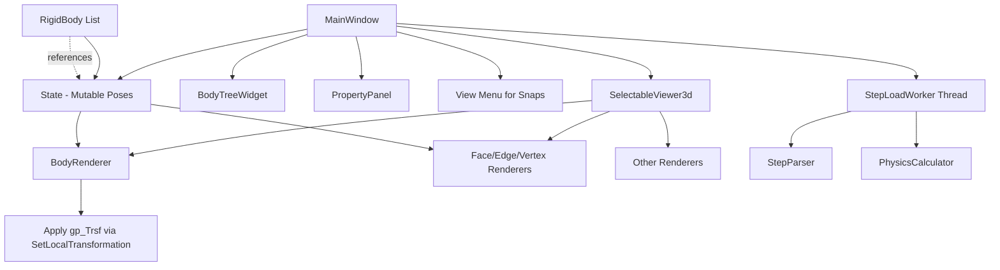
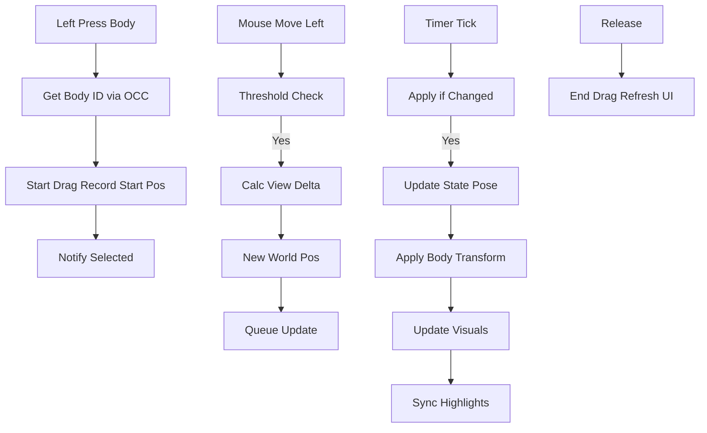
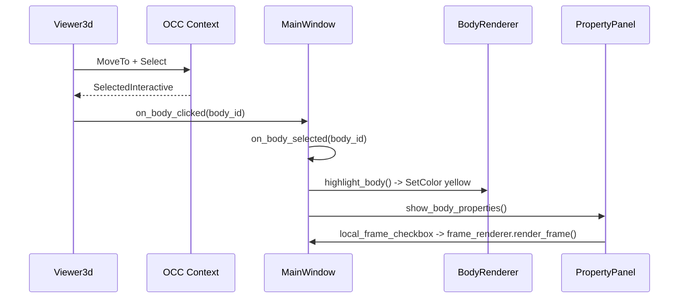
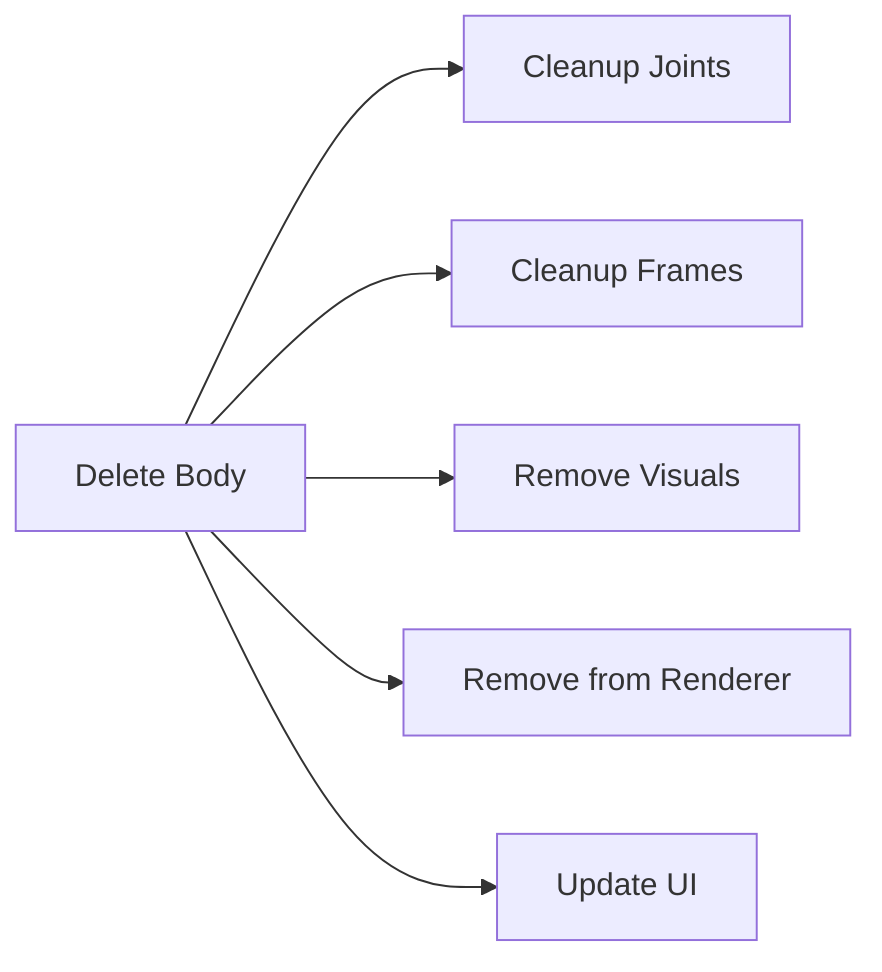

# MBD Pre-Processor - Execution Flow & Architecture Documentation

**Purpose**  
This document focuses on **runtime execution flows** and **internal architecture** rather than traditional API reference. It provides:

- Visual diagrams (Mermaid)
- Step-by-step call traces with explanations
- Data structure creation and mutation details
- Design rationale ("why" things are implemented this way)
- Threading considerations
- **Systems thinking perspective**: How components interact as a coherent system, feedback loops, boundaries, emergence, and how the design enables interactive 6DOF manipulation of assembly poses via mouse without mutating original geometry.

The goal is to help developers understand the **end-to-end behavior** and the **systemic design** when a user interacts with the application.

**Recent Changes Reflected**:
- Mutable `State` as central source of truth for body/assembly poses.
- Direct mouse dragging (no gizmo) with dedicated Left-button for body interaction in Body mode.
- Explicit camera controls: Right-drag for rotation, Middle-drag for pan.
- Live syncing of face/edge/vertex highlights with dragged body poses.
- View snapping to principal axes and isometric.
- Threaded loading + drag throttling for responsiveness.

---

## High-Level Architecture (Systems View)



**Systems Thinking Perspective**:
- **Boundaries**: Immutable geometry (`TopoDS_Shape` from STEP) is separated from mutable pose (`State`). This creates a clean boundary: geometry is "what the part is", pose is "where it is now".
- **Feedback Loops**: User mouse input → `Viewer3d` updates `State` → `Renderer` applies `gp_Trsf` → visual feedback → user sees change and continues interacting. Positive reinforcing loop for interactivity.
- **Emergence**: Full 6DOF interactive assembly editing emerges from the combination of `State` (central mutable state), delta-transform math in `update_body_transform`, and OCC's `SetLocalTransformation` (which moves display without mutating original B-Rep).
- **Leverage Point**: The `State` object is a high-leverage point. Changing a body's pose there propagates to visualization, property inspection, exports (indirectly), and future simulation without touching the heavy geometry.
- **Resilience**: Threading (load) and throttling (drag timer + epsilon checks) decouple slow/heavy operations from the UI thread, preventing the system from becoming unresponsive.
- **Components fit together** to fulfill the original goal: bodies have positions/orientations that *can* be changed interactively with the mouse because pose is externalized and rendered via lightweight local transforms.

---

## 1. Loading a STEP File Flow

**User Action**: Menu → Open STEP File → select file → Open

### Sequence Diagram


### Detailed Execution Trace with Explanations

1. **Entry Point**  
   `MainWindow.open_step_file()` (triggered from QAction)  
   → Shows native file dialog.

2. **Clearing Phase** (`_clear_ui_for_new_load`)  
   Everything from previous session is wiped on the **main thread** before starting the worker.  
   This includes:
   - All `AIS_Shape` objects (via `body_renderer.clear_all()` → `EraseAll`)
   - `self.bodies = []`
   - `self.assembly_state = None`
   - All user frames, joints, forces, torques
   - Drag state and timer

   **Why?** To avoid mixing data from two different assemblies.

3. **Background Worker** (`StepLoadWorker.run()`)  
   Heavy work runs off the main thread so the UI doesn't freeze.

   - `StepParser.load_step_file()` → returns `(TopoDS_Shape, float unit_scale)`
   - `StepParser.extract_bodies_from_compound()` → creates `List[RigidBody]`
   - Four sequential calls to `PhysicsCalculator`:
     - `calculate_volumes_for_bodies()` → populates `RigidBody.volume`
     - `calculate_centers_of_mass_for_bodies()` → populates `center_of_mass`
     - `calculate_inertia_tensors_for_bodies()` → populates `inertia_tensor`
     - `initialize_local_frames()` → creates `RigidBody.local_frame` (Frame at COM with identity rotation)

   **Data at this point**: RigidBody objects now have geometry + physical properties + a `local_frame`, but **no world pose yet**.

4. **State Creation (on main thread)**  
   ```python
   self.assembly_state = State()
   for body in bodies:
       self.assembly_state.set_body_pose(body.id, body.local_frame.origin, identity)
       body.state = self.assembly_state
   ```
   This is the moment the **mutable pose system** is born. From now on, the body's position in the world comes from `State`, not from the original STEP coordinates.

5. **Rendering**
   - `body_renderer.display_bodies()` creates one `AIS_Shape` per `RigidBody.shape`.
   - These AIS objects are stored with identity local transform initially.
   - Later, `update_body_transform()` will apply deltas based on `State`.

6. **Post-Load Work** (`_finish_step_load`)
   - Face/edge/vertex property extraction (for selection).
   - Bounding box calculation → dynamic scaling of axes and markers.
   - Viewer mapping for picking.

**Resulting State**:
- `self.bodies` — list of fully populated RigidBody
- `self.assembly_state` — holds initial poses (matching the imported geometry)
- `self.body_renderer.body_ais_shapes` — visual objects ready for transformation

---

## 2. Direct Mouse Dragging a Body (Current Implementation)

**User Action**: In **Body** selection mode, Left-click on a body and drag. (No Ctrl required.)

**Mouse Button Mapping (Systems View)**:
- **Left** (Body mode): Body selection + direct translation drag. The system treats the body as the primary interactive object.
- **Right drag**: Camera orbit/rotate (explicitly routed to `V3d_View.StartRotation`/`Rotation`).
- **Middle drag**: Camera pan (explicitly routed to `StartPan`/`Pan`).
- **Wheel**: Zoom (handled by base viewer).

This mapping creates a clear **separation of concerns** in the input layer: object manipulation vs. viewpoint navigation. Left is "act on the model", Right/Middle are "act on the view".

### Updated Flow Diagram (with Highlight Sync & Throttling)



### Detailed Explanation & Data Flow

**From 2D Mouse to 3D Pose Update**

The core mapping happens in `_screen_delta_to_world_delta`:

```python
# Camera basis in world space (from V3d_View)
right = ...
up    = ...

world_per_pixel = (view.Size() * 2) / widget_width
delta = right * (dx * world_per_pixel) - up * (dy * world_per_pixel)
new_pos = start_world_pos + delta
```

This delta is **view-plane parallel** at the body's COM depth. Only the translation component of the 6DOF `Pose` in `State` is written; rotation is preserved.

**State as the Single Source of Truth**

```python
self.assembly_state.set_body_pose(body_id, new_pos, current_rot)
body.state = self.assembly_state   # RigidBody just holds a reference
```

Everything downstream (rendering, property panel via `get_world_position()`, future exports) reads from `State`.

**Visual Update via Delta Transforms**

In `update_body_transform`:
- `desired` comes from `State`
- `base` is the pose recorded at load time (when AIS was first displayed with identity local transform)
- `delta_trsf = pose_to_trsf( desired - base composed )`
- `ais_shape.SetLocalTransformation(delta_trsf)`

This keeps original STEP geometry untouched while allowing arbitrary live placement.

**Live Sub-shape Highlight Sync (Recent Fix)**

After a body is moved:
- If a face/edge/vertex was (or is) selected on that body, `_sync_highlight_transforms` applies the **exact same** `LocalTransformation` to the highlight `AIS_Shape`.
- When you select a face *after* dragging, the highlight creation site now passes the current body `trsf`.

This closes the feedback loop between pose mutation and sub-geometry visualization.

**Throttling & Smoothness Mechanisms**

- Pixel threshold in move handler reduces callback spam.
- QTimer decouples high-frequency mouse events from rendering.
- Epsilon check in `_apply` skips micro-changes.
- `Redisplay(False)` + single controlled `UpdateCurrentViewer`/`Repaint` per tick.

These are deliberate **dampening** elements in the interaction feedback loop to prevent visual jitter while maintaining responsiveness.

**Systems Note on Dragging**:
Dragging is not a simple "move object" operation. It is a coordinated mutation across:
- Input system (Viewer3d)
- Domain model (`State`)
- Visualization system (BodyRenderer + sub-shape renderers)
- OCC display context

The emergence is "the body follows my mouse in 3D space" while the underlying B-Rep remains pristine. This is only possible because pose is externalized.

---

## 3. Body Selection Flow (Viewer Click)



**Important Detail**:
When you left-click a body, both drag-start and selection logic run. The release event decides whether it was a "click" or a "drag" based on whether `_dragging_body_id` was set.

---

## 4. Face / Edge / Vertex Selection Flow (with Pose Awareness)

1. User changes mode in `PropertyPanel` → `selection_mode_changed` signal
2. `viewer_3d.set_selection_mode("Face")` → `ctx.Deactivate()` + `Activate(ais, 4)` for all bodies (activates sub-shape selection modes on the AIS objects)
3. Left click (in non-Body mode) → press is consumed (no drag), release calls `_select_at_position`
4. Inside `_select`: OCC selection returns sub-shape owner → `_extract_sub_shape_index` matches against original `body.shape` explorer → calls `on_face_clicked_in_viewer`
5. Highlight creation now receives the body's **current** `LocalTransformation` (from its AIS, which reflects live `State` pose) and applies it to the highlight AIS.

**Recent Change (Highlight Sync)**:
After any pose change (drag), `_sync_highlight_transforms` reapplies the body's current `trsf` to active face/edge/vertex highlights belonging to that body. This ensures sub-geometry visualizations remain consistent with the mutable pose.

**Pre-computed Data**:
Face/edge/vertex properties are extracted once after loading (in `_finish_step_load`) because extraction is relatively expensive. The *rendering* of highlights, however, is now pose-aware.

---

## 5. State vs Local Frame Relationship (Systems View)

This is a common point of confusion and a key **boundary** in the system.

- `RigidBody.local_frame`: The body's **intrinsic** coordinate system (COM origin + body axes). Computed once at load time from the immutable geometry. It represents "what this part's own coordinate frame is."
- `State.body_poses[id]`: The body's **extrinsic, mutable placement** in the world. This is what the user changes with the mouse.

**Interaction**:
- Drag updates only the `Pose` inside `State`.
- For UI convenience, `local_frame.origin/rotation` is mirrored (but conceptually it should remain intrinsic).
- All rendering derives the final `gp_Trsf` from the relationship:
  ```
  visual_trsf = desired_pose_trsf ∘ inv(base_pose_trsf)
  ```
  where `base_pose_trsf` is the pose recorded when the AIS was first created.

This design creates **loose coupling** between "what the body is" (geometry + local_frame) and "where the body is right now" (State). It is the central mechanism that fulfills the original requirement: "positions and orientations ... that can be interactively changed using mouse."

---

## 6. Deletion Flow (High Level)



---

## 7. View Snapping (Axes + Isometric)

**User Action**: View menu → Top / Front / Isometric, etc.

### Implementation
- Simple direct calls on `V3d_View`:
  ```python
  v.SetProj(px, py, pz)
  v.SetUp(ux, uy, uz)
  v.FitAll()
  ```
- Isometric uses `(1,1,1)` direction with Z-up.
- Called from `MainWindow` and immediately update the viewer.

This is a pure **view** operation — it does not touch `State` or any body poses. It is a convenience for the user to quickly align the camera with the world coordinate system or get a useful 3D overview.

---

## 8. Systems Thinking Perspective: How the Components Fit Together

The MBD Pre-Processor is best understood as a **socio-technical system** whose purpose is to let a human interactively define and explore the **mutable spatial configuration** of an assembly whose intrinsic geometry is fixed.

### Core Components as a System

| Component              | Role in the System                          | Type          | Key Interfaces |
|------------------------|---------------------------------------------|---------------|----------------|
| **State / Pose**       | Single source of truth for all mutable 6DOF poses | Domain Model | Read by RigidBody, written by drag logic, read by renderers |
| **RigidBody**          | Holds immutable geometry + reference to current pose | Entity        | `.state`, `.local_frame`, `shape` |
| **SelectableViewer3d** | Input boundary + camera control             | Input/Adapter | Mouse events, OCC picking, explicit Right/Middle camera |
| **BodyRenderer** (+ sub renderers) | Visualization of pose on top of geometry | View          | `update_body_transform`, highlight with trsf |
| **MainWindow**         | Coordinator / Mediator                      | Controller    | Wires signals, owns State + collections, orchestrates threads |
| **StepLoadWorker**     | Asynchronous heavy computation boundary     | Infrastructure| Progress/result signals, keeps UI responsive |
| **OCC AIS / V3d**      | Low-level 3D display and interaction engine | External Platform | SetLocalTransformation, Select, SetProj, etc. |

### Feedback Loops (Causal Loops)

1. **Primary Interaction Loop** (Reinforcing):
   Mouse delta → State mutation → Renderer applies transform → Visual change → User perceives result → issues new mouse input.

2. **Consistency Loop** (Balancing):
   Body pose changes → `_sync_highlight_transforms` → sub-shape highlights move → User continues to see correct face/edge on the moved body.

3. **Responsiveness Loop** (Balancing):
   High-rate mouse events → throttling (timer + epsilon) → bounded render rate → UI remains fluid even on complex models.

4. **Loading Responsiveness Loop**:
   Heavy computation → background thread + progress signals → main thread stays responsive → user can still interact with other parts of the UI.

### Boundaries and Interfaces

- **Geometry Boundary**: Once loaded, `TopoDS_Shape` is treated as immutable. All placement happens via `gp_Trsf` on `AIS_Shape`. This protects the expensive B-Rep data.
- **Pose Boundary**: `State` is the only place that holds "where things are now." This makes the system **pose-centric** rather than geometry-centric.
- **Input Boundary**: Viewer3d translates raw Qt mouse events into either "object manipulation" (Left in Body mode → State) or "view manipulation" (Right/Middle → camera).
- **Threading Boundary**: Only pure computation (parsing + physics) crosses into `QThread`. All display and State mutation that affects visuals stays on the main thread.

### Emergence

The ability to "drag bodies around" is not implemented in any single class. It emerges from the tight, well-defined collaboration between:

- Mutable `State`
- Delta-transform math
- OCC's local transformation capability on interactive objects
- Throttled event loop
- Live synchronization of dependent visualizations (highlights)

If any of these elements were missing or tightly coupled to the geometry, the desired interactive behavior would not appear.

### Leverage Points (in order of increasing power)

1. Change the pixel/world scale factor in `_screen_delta_to_world_delta` (quick tuning of "feel").
2. Adjust timer interval or epsilon (responsiveness vs. smoothness trade-off).
3. Extend `State` with additional constraints or history (undo, snapping).
4. Change the **boundary** between geometry and pose (e.g., store poses relative to parent in a hierarchy) — this would have systemic effects on joints, export, etc.
5. Introduce new input mappings or modes (e.g., Shift+Left for body rotation) — changes the "interaction grammar" of the whole system.

This systems view makes it clear why the `State` class was the pivotal addition requested by the user: it is the **central leverage point** that turns a static viewer into an interactive assembly editor.

---

## Summary of Current Mouse & Interaction Model

- **Left click/drag** (Body mode): Select + translate body via direct mouse. Updates `State`, body visual, and any active sub-highlights.
- **Right drag**: Camera rotation (explicit).
- **Middle drag**: Camera pan (explicit).
- **View menu**: Instant camera snaps to world axes or isometric (does not affect `State`).
- Sub-shape selection (Face/Edge/Vertex) works independently and now correctly follows moved bodies.

The design cleanly separates **what the parts are** (immutable geometry + local frames) from **where the parts are** (mutable `State`), while providing a responsive, direct-manipulation interface on top of the powerful but geometry-centric OCC display system.