# MBD Pre-Processor — Systems Architecture & Kinematic Solver

**Purpose**  
Document the codebase **from first principles** using **systems thinking**: what the system is for, what must stay invariant, what is mutable, how information flows, which feedback loops create interactive behavior, and where leverage lives. Emphasis is on the **position-level kinematic assembly solver** (`core/kinematics/`) and how it plugs into pose, joints, drag, and rendering without mutating CAD geometry.

This is **not** an API reference dump. It explains *why* the pieces exist and how they produce the emergent behavior: “I drag one part and the mechanism moves as if it were assembled.”

---

## 0. First principles — what problem does this software solve?

### 0.1 The product purpose

MBD Pre-Processor is a **socio-technical bridge** between:

1. **CAD truth** — B-Rep geometry from STEP (what the parts *are*).
2. **Mechanism truth** — bodies + joints + poses that a dynamics solver can consume (how the parts *move relative to each other*).
3. **Human intent** — interactive placement and joint definition via a 3D GUI.

The human’s job is to turn a static multi-solid import into a **kinematic assembly**: rigid bodies, joint types, frames/markers, optional loads/motors, export.

### 0.2 The three layers of truth (invariants vs mutables)

From first principles, three kinds of information must not be confused:

| Layer | Question it answers | Mutability | Primary types |
|-------|---------------------|------------|---------------|
| **Geometry** | What is the solid? | Immutable after load | `TopoDS_Shape` on `RigidBody` |
| **Intrinsic body frame** | Where is the COM / body axes relative to the solid? | Fixed at physics init (conceptually intrinsic) | `RigidBody.local_frame`, volume, COM, inertia |
| **Extrinsic pose** | Where is this body in the world *right now*? | Highly mutable | `State.body_poses` → `Pose` |
| **Joint definition** | How may two bodies move relative to each other? | Created by user; markers frozen at creation | `Joint` + `marker1`/`marker2` |
| **Constraint satisfaction** | Are the poses consistent with the joints? | Recomputed continuously | `KinematicSolver` residuals |

If geometry and pose are fused (move by mutating B-Rep), interactive 6DOF editing and constraint solving become expensive and irreversible. The core design decision is:

> **Pose is externalized into `State`. Display uses OCC local transforms. Constraints act on poses via body-local joint markers.**

### 0.3 What the kinematic solver is *not*

- Not dynamics (no mass, forces, time integration in the solve loop).
- Not mesh collision.
- Not CAD feature history.
- Not a replacement for the downstream MBD simulator.

It answers only:

> Given joints and a desired placement intent (mouse pin or “snap everything”), what body poses make Φ(q) ≈ 0?

---

## 1. High-level architecture (systems view)

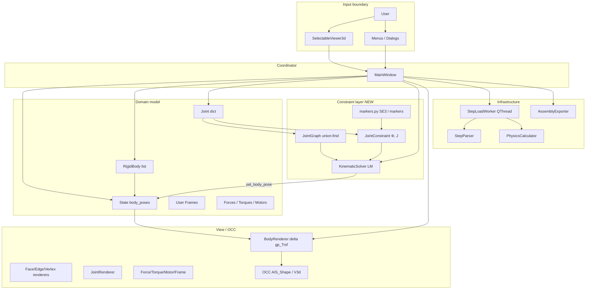

### Systems vocabulary for this app

| Concept | Meaning here |
|---------|----------------|
| **Boundary** | Geometry stays immutable; pose mutates only in `State`; solver is pure numpy (no OCC). |
| **Stock** | Body poses in `State`; joint markers once captured. |
| **Flow** | Mouse deltas → desired pin → solver → pose updates → AIS transforms → pixels. |
| **Feedback** | Visual motion changes the next mouse intent (reinforcing). Constraint residuals pull poses back (balancing). |
| **Delay** | Drag timer throttling; LM iterations per tick. |
| **Leverage** | `State` write path; marker capture at joint creation; drag hook calling `solve_drag`. |
| **Emergence** | “Mechanism drag” and “assembly snap” are not single functions — they appear when markers + graph + LM + State + renderer align. |

---

## 2. Package map (where code lives)

```
MBD-PreProcessor/
├── main.py                      # MainWindow: load, drag, joints, solve UI
├── core/
│   ├── data_structures.py       # RigidBody, Frame, Pose, State, Joint, Force, Torque
│   ├── step_parser.py           # STEP → shapes / bodies
│   ├── physics_calculator.py    # volume, COM, inertia, local frames
│   ├── geometry_utils.py        # faces/edges/vertices extraction helpers
│   └── kinematics/              # ★ position-level assembly solver
│       ├── __init__.py          # KinematicSolver, capture_joint_markers
│       ├── markers.py           # SE(3), exp/log SO(3), marker capture
│       ├── graph.py             # JointGraph connected components
│       ├── constraints.py       # Φ(q), analytic J per joint type
│       └── solver.py            # LM loop, solve_assembly / solve_drag
├── gui/                         # Viewer, tree, property panel, dialogs
├── visualization/               # Body/joint/… AIS renderers
├── export/                      # JSON export for downstream MBD
└── tests/test_kinematics.py     # Headless solver tests
```

**Separation rule:** `core/kinematics` imports only `numpy` + `core.data_structures`. It is headless-testable. GUI and OCC never enter the Newton loop.

---

## 3. Domain model from first principles

### 3.1 RigidBody — entity with immutable geometry

- `id`, `shape` (B-Rep), physical props, `local_frame` (COM frame at load).
- `state: Optional[State]` — a **reference**, not owned pose storage.
- `get_world_position()` / `get_world_rotation_matrix()` read from `State` when present.

### 3.2 Pose and State — the single source of mutable placement

```text
State
├── assembly_pose : Pose          # reserved root transform
└── body_poses : { body_id → Pose }   # world origin + R (3×3)
```

**Invariant:** anything that “moves a body” in the interactive sense must eventually call `State.set_body_pose`. Renderers and property UI must *read* poses, not invent private copies as truth.

### 3.3 Frame vs Pose vs marker

| Type | Role |
|------|------|
| `Frame` | Named origin + R; used for UI frames, joint creation frame, markers |
| `Pose` | Unnamed 6DOF placement in `State` |
| **Marker** | A `Frame` stored **in body-local coordinates** on a joint (`marker1`, `marker2`) |

### 3.4 Joint — kinematic relationship, not a visual only

```text
Joint
├── name, joint_type, body1_id, body2_id   # body_id -1 = ground
├── frame     # world frame at creation (UI / legacy display)
├── axis      # "+X"…"−Z" motion axis in the joint frame
├── marker1   # joint pose in body1 local coords  ★ solver
├── marker2   # joint pose in body2 local coords  ★ solver
└── motor fields (export / visualization; not used by position solver)
```

**First principle of joints:** a joint is defined once relative to each body. After that, when bodies move, the joint “moves with them” because world joint frames are reconstructed as:

```text
P_i = T_body_i ∘ M_i
```

where `T_body` comes from `State` and `M_i` is the captured marker.

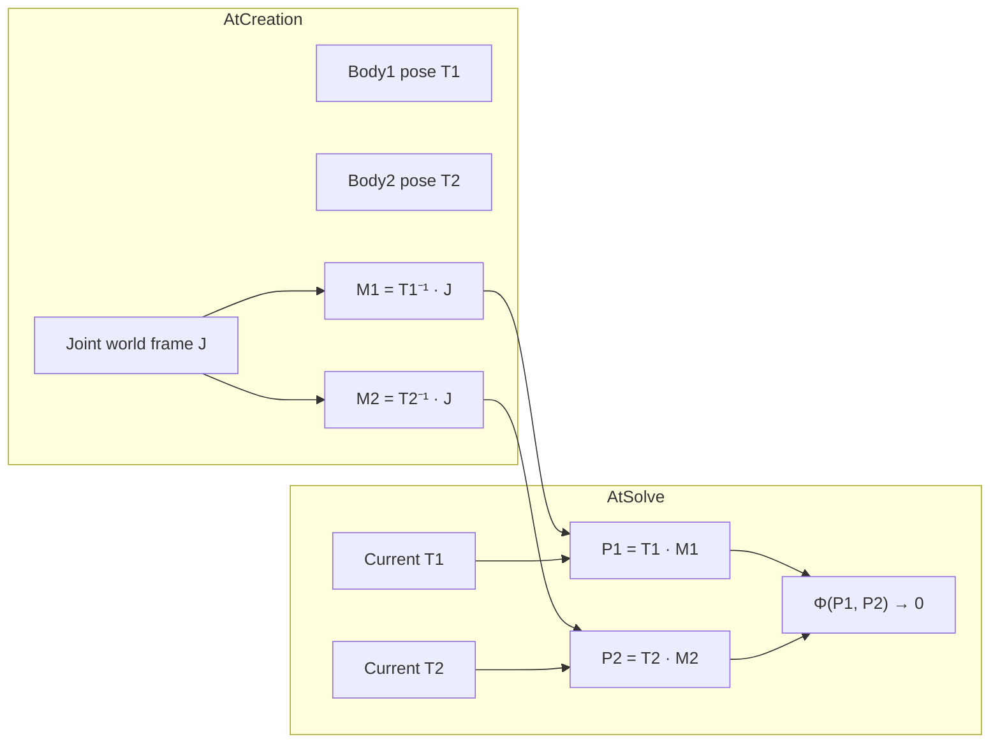

`capture_joint_markers(joint, body1_pose, body2_pose)` in `core/kinematics/__init__.py` performs the creation-time capture. `MainWindow` calls it when a joint is created and lazily if markers are missing before solve.

---

## 4. The kinematic solver — deep dive

### 4.1 Problem statement (math)

Unknowns: for each **movable** body, a world pose. Parametrized inside the Newton loop by a 6-vector increment per body:

```text
δ = [ dpₓ, dpᵧ, dp_z,  δωₓ, δωᵧ, δω_z ]
p ← p + dp
R ← exp([δω]×) R     (left / world-frame rotation update)
```

Ground (`body_id == -1`) contributes **no unknowns**.

Constraints: stack residuals Φ(q) from every joint. Solve the nonlinear least-squares problem

```text
min_q  ‖ W_joint · Φ(q) ‖²  (+ optional soft pin on dragged body)
```

with a **Levenberg–Marquardt** (damped Gauss–Newton) iteration using **analytic Jacobians**.

This is the classical **full-Cartesian / absolute coordinate** assembly formulation (Haug-style position constraints; SolveSpace-like UX for drag pinning and group decomposition).

### 4.2 Module responsibilities

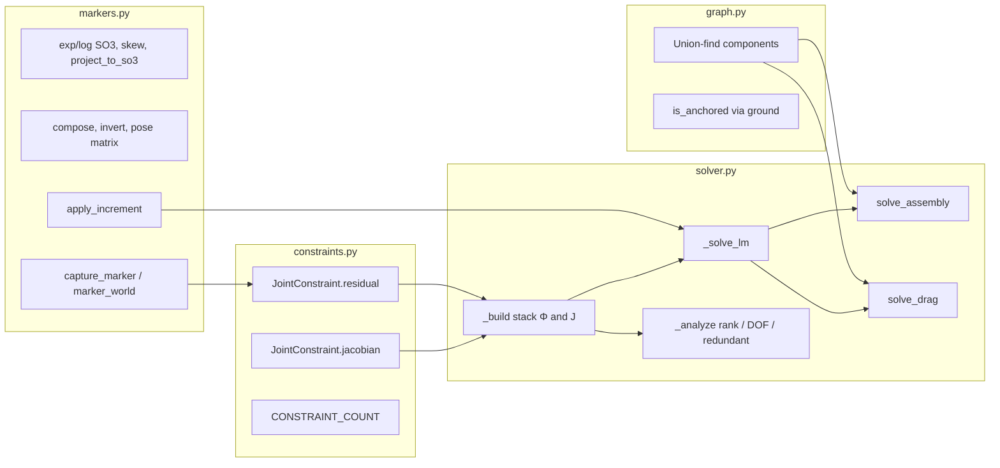

| File | Responsibility |
|------|----------------|
| `markers.py` | Lie-group math + body-local markers |
| `graph.py` | Which bodies must move together; solve only needed component |
| `constraints.py` | Per-joint Φ and ∂Φ/∂δ |
| `solver.py` | System assembly, LM, public API, redundancy/DOF report |

### 4.3 Constraint equations by joint type

World frames of the two markers: origins `o1, o2`, rotations `R1, R2`. Motion axes `a1 = R1 a_local`, `a2 = R2 a_local` where `a_local` comes from `Joint.axis`.

| Joint | Residual stack (implementation) | Nominal DOF removed | Notes |
|-------|----------------------------------|---------------------|-------|
| **FIXED** | `(o1−o2)` (3) + `log(R2 R1ᵀ)` (3) | 6 | Full weld |
| **REVOLUTE** | `(o1−o2)` (3) + `a1×a2` (3) | 5 | Cross product rank 2; LS absorbs deficiency |
| **PRISMATIC** | `a1×(o2−o1)` (3) + orientation lock (3) | 5 | Slide along axis; no relative rotation |
| **CYLINDRICAL** | `a1×(o2−o1)` (3) + `a1×a2` (3) | 4 | Slide + spin about same axis |
| **SPHERICAL** | `(o1−o2)` (3) | 3 | Ball joint |

`CONSTRAINT_COUNT` stores the **number of residual rows** written (often 6 with rank-deficient blocks). True mobility uses **Jacobian SVD rank**, not row count.

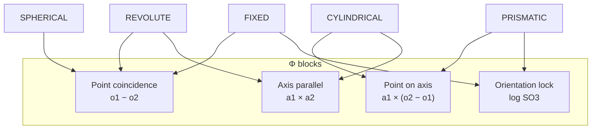

### 4.4 Analytic Jacobians (why they matter)

For left increments on SO(3)/SE(3):

- Point attached to a body:  
  `∂p_world/∂δ = [ I | −[p − body_origin]× ]`
- Direction attached to a body:  
  `∂d_world/∂δ = [ 0 | −[d]× ]`
- Orientation residual `log(R2 R1ᵀ)`:  
  `∂/∂ω1 ≈ −I`, `∂/∂ω2 ≈ +I` (consistent with left increments)

Cross-product residuals differentiate via product rule and skew identities (implemented in `JointConstraint.jacobian`).

**Systems note:** analytic J makes each drag tick cheap enough for interactive rates and keeps finite-difference noise out of the balancing loop. `tests/test_kinematics.py` checks J against central differences.

### 4.5 Group decomposition (JointGraph)

Bodies = nodes, joints = edges, ground = node `-1`.

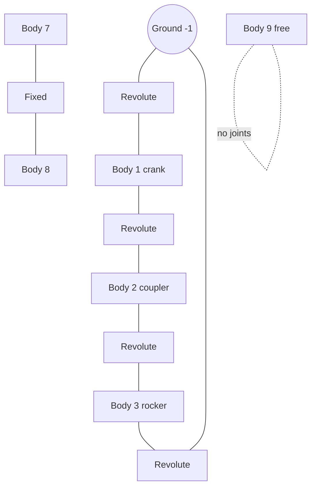

- `solve_drag(body_id, …)` solves **only** `component_of(body_id)`.
- `solve_assembly()` solves **each** component with joints independently.
- Unrelated free bodies are untouched — critical for large assemblies and for UX predictability.

This is the SolveSpace-inspired “group” idea at assembly scale.

### 4.6 Levenberg–Marquardt loop (`_solve_lm`)

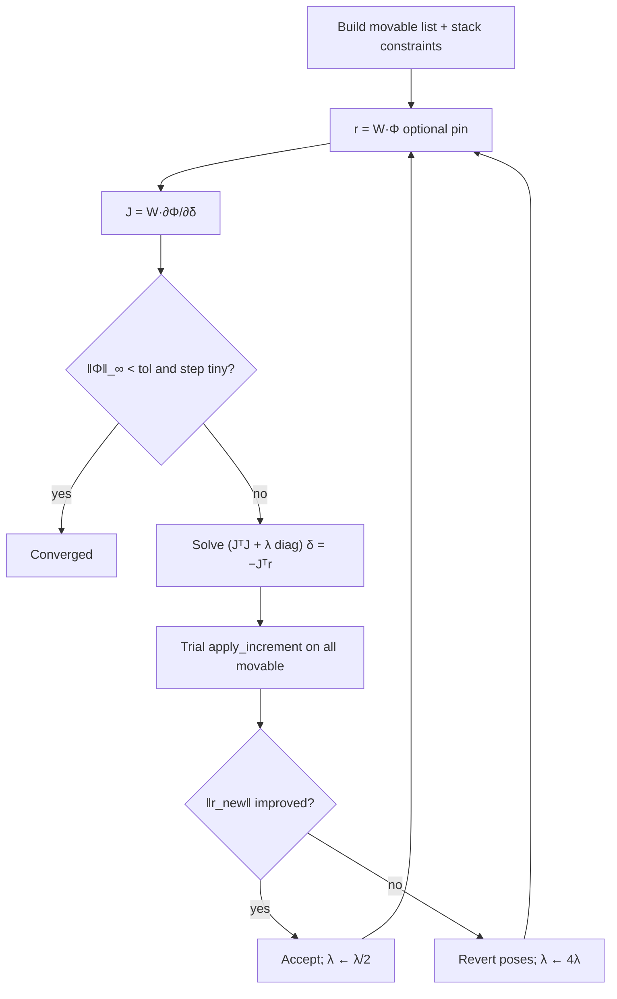

Design choices encoded in code:

| Choice | Implementation | Why |
|--------|----------------|-----|
| Hard joints, soft pin | `joint_weight≈1e3` on Φ; `pin_weight` on drag target | Mouse is intent; joints win if conflict |
| Pin position-only on drag | `pin_orientation=False` default in `solve_drag` | Matches translation mouse drag |
| Damping on `diag(JᵀJ)` | LM diagonal scaling | Handles rank loss / redundancy |
| SO(3) projection | `project_to_so3` on write | Kills numerical drift |
| Component-local solve | `JointGraph` | Performance + isolation |

### 4.7 Soft pin = how drag becomes mechanism motion

Without solver:

```text
mouse → set_body_pose(dragged only) → one AIS moves
```

With solver:

```text
mouse target t
→ min ‖W Φ(q)‖² + w_pin ‖p_drag − t‖²
→ all movable bodies in the component update in State
→ all their AIS update
```

If the target is unreachable (e.g. pin outside a pendulum circle), joints stay nearly satisfied and the body moves to the **feasible** pose closest (in the weighted LS sense) to the pin — classic soft constraint trade-off.

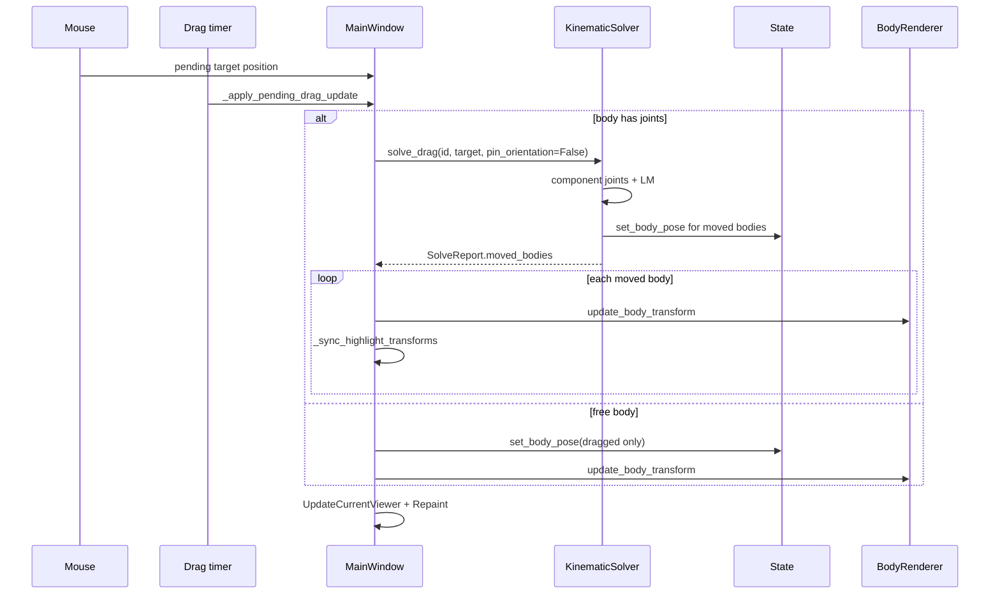

### 4.8 Assembly snap (`solve_assembly` / Ctrl+K)

One-shot solve with **no pin**: pure constraint satisfaction from the current poses as initial guess. Used to repair imports / user mess, and as a trust-building “make it valid” command.

Report (`SolveReport`):

- `converged`, `iterations`, residual norms  
- `per_joint_residual`  
- `moved_bodies`  
- `redundant_joints` (leave-one-joint-out rank test when `n_eq > rank`)  
- `dof = n_unknown − rank(J)`  

UI: Assembly menu → **Solve Assembly** (`Ctrl+K`) → dialog + status bar summary.

### 4.9 DOF and redundancy (analysis subsystem)

After solve (or on demand in `solve_assembly(analyze=True)`):

1. Assemble dense J for movable bodies and joints.  
2. `rank = #{ singular values > threshold }`.  
3. `dof = max(0, 6·n_movable − rank)`.  
4. If overdetermined in rows vs rank, test each joint’s row block: if removing it does not drop rank, flag joint name as **redundant**.

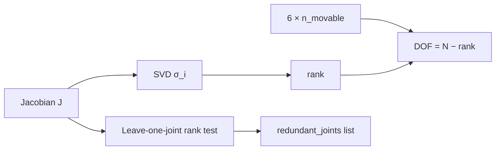

Example mental models:

- Pendulum (ground–revolute–body): ~1 DOF.  
- Four-bar (ground + 3 bodies, 4 revolutes): 1 DOF.  
- Two coincident FIXED joints body–ground: 0 DOF, redundant joint reported.

### 4.10 Public API surface

```python
from core.kinematics import KinematicSolver, capture_joint_markers, SolveReport

capture_joint_markers(joint, (o1, R1), (o2, R2))

solver = KinematicSolver(
    bodies, joints, state,
    ground_id=-1,
    ground_pose=(o_g, R_g),
    locked_body_ids=None,  # extra immovable bodies
)

report = solver.solve_assembly(max_iters=50, tol=1e-9, analyze=True)
report = solver.solve_drag(body_id, target_origin, target_R=None,
                           pin_weight=100.0, max_iters=30, tol=1e-8,
                           pin_orientation=False)
```

`MainWindow._make_kinematic_solver()` ensures markers exist, then constructs the solver over live `self.bodies`, `self.joints`, `self.assembly_state`.

---

## 5. End-to-end runtime flows

### 5.1 Load STEP (geometry → bodies → State)

```mermaid
sequenceDiagram
    participant U as User
    participant MW as MainWindow
    participant W as StepLoadWorker
    participant P as StepParser
    participant Ph as PhysicsCalculator
    participant S as State
    participant BR as BodyRenderer

    U->>MW: Open STEP
    MW->>MW: _clear_ui_for_new_load
    MW->>W: start thread
    W->>P: load_step_file / extract_bodies
    W->>Ph: volume, COM, inertia, local_frames
    W-->>MW: bodies, unit_scale
    MW->>S: State(); set_body_pose each body
    MW->>BR: display_bodies (record base poses)
    MW->>MW: extract sub-shapes, enable UI
```

**Why a worker thread?** Parsing and mass properties are slow; they sit outside the interactive feedback loop so the UI stock (responsiveness) is not drained.

After load, poses match imported geometry (identity delta on AIS). Joints do not exist yet → free dragging is pure State mutation.

### 5.2 Create joint (definition freeze)

1. Dialog picks type, two bodies (or ground), a world `Frame`, axis.  
2. `Joint(...)` constructed.  
3. `capture_joint_markers` freezes `marker1`/`marker2` from **current** body poses.  
4. Tree + `JointRenderer` update.

**Systems warning:** markers capture the relative geometry **at creation time**. If bodies were already misaligned relative to the intended mate, the joint “defines” that misalignment. Snap (`solve_assembly`) then tries to satisfy *that* definition — it does not re-infer CAD mates.

### 5.3 Free drag vs constrained drag

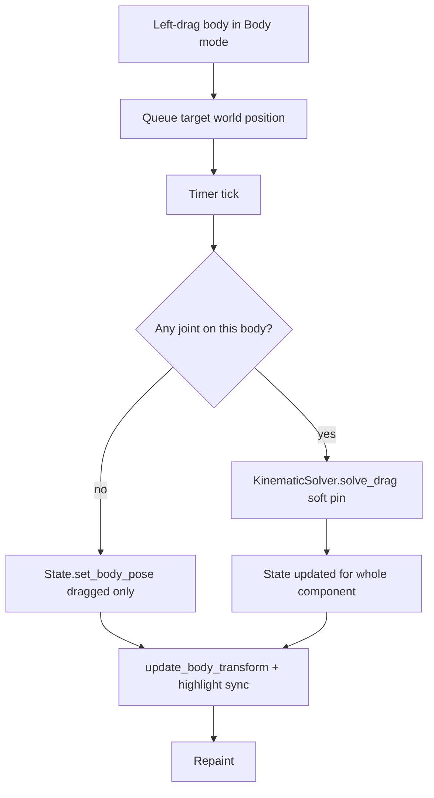

Throttling (pixel threshold, QTimer, epsilon on applied position) is a **balancing loop** against event spam — it keeps the LM + OCC path inside a stable frame budget.

### 5.4 Rendering contract (geometry vs pose)

`BodyRenderer` records `_base_poses` at first display. On update:

```text
desired = State pose
base    = pose at display time
Δ = desired ∘ base⁻¹   (as gp_Trsf)
AIS.SetLocalTransformation(Δ)
```

**Invariant:** original `TopoDS_Shape` never moves. Highlights copy the same local `trsf` via `_sync_highlight_transforms`.

### 5.5 Selection and camera (input grammar)

| Input | Meaning |
|-------|---------|
| Left (Body mode) | Select + translate drag (possibly constrained) |
| Left (Face/Edge/Vertex) | Sub-shape pick |
| Right drag | Camera orbit |
| Middle drag | Pan |
| Wheel | Zoom |
| View menu snaps | Camera only — never State |
| Ctrl+K | `solve_assembly` |

Clear separation: **model manipulation** vs **view manipulation** vs **constraint repair**.

---

## 6. Causal loop diagram (how behavior emerges)

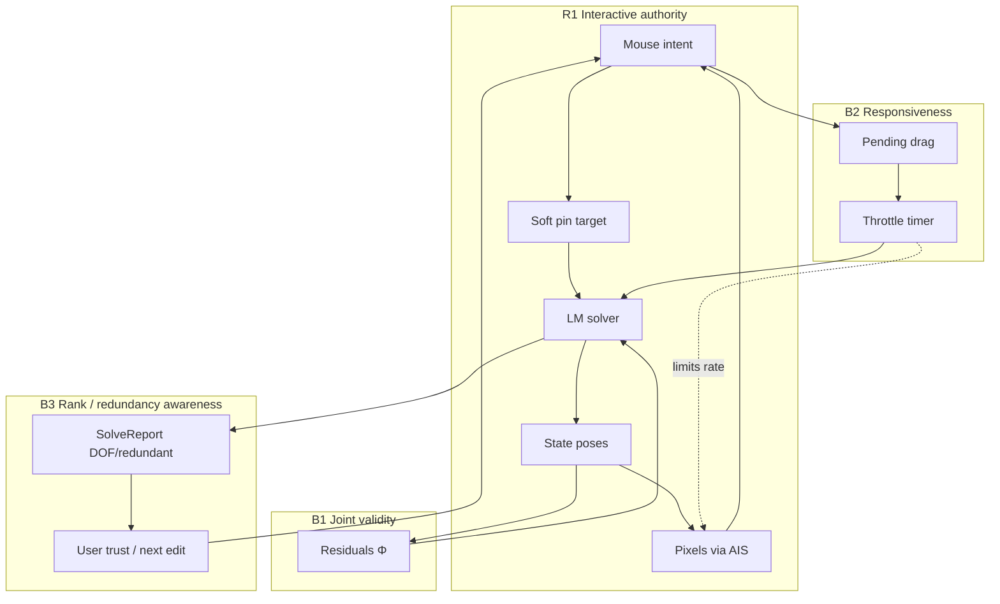

| Loop | Type | If broken |
|------|------|-----------|
| R1 | Reinforcing | App feels dead; no mechanism joy |
| B1 | Balancing | Bodies fly apart; joints become stickers |
| B2 | Balancing | UI freezes or jitters |
| B3 | Balancing | User cannot debug overconstrained assemblies |

**Emergence:** “Dragging a four-bar and watching it articulate” requires R1+B1+B2 together with correct markers and component graph. Remove markers → joints stay world-fixed decorations. Remove graph scoping → unrelated parts thrash. Remove soft pin → dragged body ignores the mouse or hard-locks.

---

## 7. Component roles (systems table)

| Component | System role | Reads | Writes |
|-----------|-------------|-------|--------|
| `State` | Stock of extrinsic poses; **highest leverage** | Everyone downstream | Drag, solver, (future undo) |
| `RigidBody` | Geometry + identity + physics props | `State` for world pose | Load/physics only for intrinsic fields |
| `Joint` + markers | Constraint definitions | — | Creation-time marker freeze |
| `JointGraph` | Topology / decomposition | Joint endpoints | — (ephemeral) |
| `JointConstraint` | Φ and J | poses via callback | — |
| `KinematicSolver` | Constraint satisfaction engine | bodies, joints, State | `State` poses |
| `SelectableViewer3d` | Input boundary | OCC pick | signals / camera |
| `BodyRenderer` | Pose→pixels adapter | `State`, base poses | AIS local trsf |
| `MainWindow` | Mediator / policy | all | wires loops, owns collections |
| `StepLoadWorker` | Heavy compute boundary | file | result signal |
| OCC AIS/V3d | Display platform | transforms, selection | framebuffer |

---

## 8. Boundaries and non-negotiable contracts

1. **Geometry boundary** — no solver or drag path mutates `TopoDS_Shape`.  
2. **Pose boundary** — solver and drag write only through `State.set_body_pose`.  
3. **Marker boundary** — joint meaning is markers + type + axis; world `Joint.frame` is creation snapshot / display aid.  
4. **Threading boundary** — LM runs on the UI thread today (short max_iters on drag). Heavy STEP work is off-thread. Do not touch AIS from workers.  
5. **Headless boundary** — `core/kinematics` must remain importable without OCC/Qt (see `tests/test_kinematics.py`).  
6. **Ground boundary** — `body_id == -1` is locked; anchors components that include it.

---

## 9. Worked examples (mental simulation)

### 9.1 Simple pendulum

- Bodies: ground + body 1.  
- Joint: REVOLUTE at origin, axis +Z.  
- Markers: M1 on ground at origin; M2 on body at the hinge point in body coordinates.  
- Drag body tip in XY: pin pulls COM; Φ forces hinge coincidence + axis parallel → body swings on a circle.  
- Expected mobility ≈ 1.

### 9.2 Prismatic slider

- Residuals kill off-axis translation and relative rotation; free coordinate is slide along axis.  
- Drag sideways: solver returns body to the rail while chasing the pin along the allowed line.

### 9.3 Four-bar (closed loop)

- Full Cartesian formulation handles the loop without cutting joints manually.  
- After perturbation, `solve_assembly` closes the loop; `dof` should be 1 when modeled like the unit test.  
- Dragging the coupler moves crank and rocker together via one LM system on the component.

### 9.4 Overconstrained double weld

- Two FIXED joints body–ground → rank deficient extra rows → `redundant_joints` non-empty, `dof == 0`, still LS-solvable if consistent.

---

## 10. Testing strategy for the solver

`tests/test_kinematics.py` (run: `python tests/test_kinematics.py`):

| Test | Proves |
|------|--------|
| `test_jacobian_finite_difference` | Analytic J trust for all joint types |
| `test_pendulum` / `test_slider` | Open-chain constraint satisfaction |
| `test_four_bar` | Closed loop + DOF≈1 |
| `test_over_constrained` | Redundancy reporting |
| `test_drag_pin` | Soft pin vs revolute feasibility |

These are the **regression fence** around the constraint layer. GUI tests are separate and slower; keep kinematics pure.

---

## 11. Leverage points (ordered)

1. **Marker capture quality** — wrong markers ⇒ permanently wrong mechanism.  
2. **`State` as sole pose bus** — keeps renderer, export, solver coherent.  
3. **Drag hook policy** (`solve_drag` vs free set) — defines product feel.  
4. **`pin_weight` / `joint_weight` / `max_iters` / `tol`** — snappy vs rubbery vs jitter.  
5. **Graph component isolation** — scalability and predictability.  
6. **Jacobian rank analysis** — teachability of “why won’t this assemble”.  
7. **Future:** locked bodies, hierarchical assemblies, undo stack on State, joint renderer drawing live `T·M` frames.

Changing geometry loading without touching these usually does **not** change interactive kinematics. Changing marker or State contracts ripples everywhere.

---

## 12. Loading, interaction, and solver — unified story

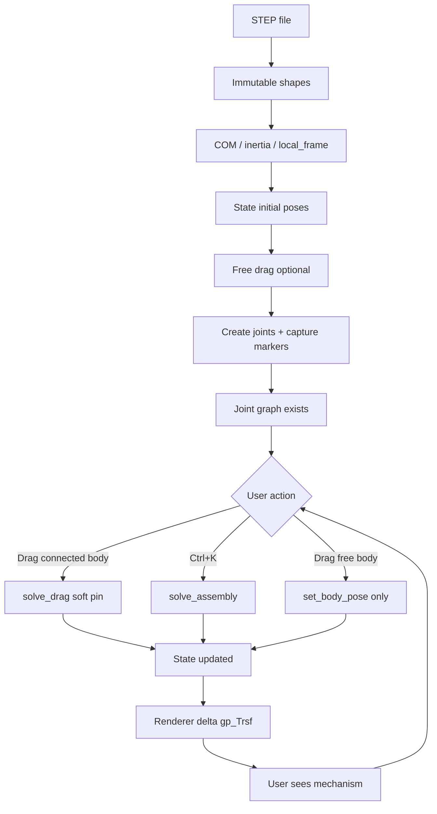

**One-sentence architecture:**  
*Immutable CAD solids are placed by mutable world poses; joints bind poses through body-local markers; a damped least-squares solver keeps poses on the constraint manifold while the UI writes intent as a soft pin; OCC only displays deltas.*

---

## 13. Legacy / known gaps (honest systems debt)

Documented so future work does not rediscover them:

1. **JointRenderer** may still emphasize creation-time world `Joint.frame` more than live `marker_world(T, M)` — comments in `solve_assembly` note possible visual lag vs solver truth.  
2. **`local_frame` mirroring** during drag updates origin/R for UI convenience; conceptually intrinsic COM frame vs extrinsic pose can blur — prefer reading `State` for “where is the body”.  
3. **Drag LM on UI thread** with `max_iters=12` — fine for small assemblies; large dense components may need iteration caps, warm starts, or async solve with pose preview.  
4. **Motors / forces** are model + export/visual concerns; they do **not** enter Φ(q) in the position solver.  
5. **README joint list** may mention types not all implemented in solver enums — solver supports FIXED, REVOLUTE, PRISMATIC, CYLINDRICAL, SPHERICAL only.

---

## 14. Summary

| Question | Answer in this codebase |
|----------|-------------------------|
| What never changes after load? | B-Rep geometry |
| What is the live configuration? | `State.body_poses` |
| What defines allowed relative motion? | `Joint` type + axis + markers |
| What enforces that definition? | `KinematicSolver` (LM on Φ, J) |
| How does the user drive it? | Soft-pinned drag + Ctrl+K snap |
| How does the screen stay honest? | `SetLocalTransformation` deltas + highlight sync |
| Why systems thinking? | Mechanism behavior is a loop property, not a single class feature |

The kinematic solver is the **constraint layer** that turned a pose-editable STEP viewer into a **mechanism pre-processor**: same State bus, same renderer contract, new balancing law on the joint graph.

---

## Appendix A — File quick index (solver-centric)

| Path | One-liner |
|------|-----------|
| `core/kinematics/markers.py` | SE(3)/SO(3) and marker capture |
| `core/kinematics/graph.py` | Connected components / ground anchor |
| `core/kinematics/constraints.py` | Residuals + analytic Jacobians |
| `core/kinematics/solver.py` | LM, solve_assembly, solve_drag, analyze |
| `core/kinematics/__init__.py` | Public exports + `capture_joint_markers` |
| `core/data_structures.py` | Joint markers fields; State/Pose/RigidBody |
| `main.py` | Drag integration, joint create, Ctrl+K |
| `visualization/body_renderer.py` | Base pose + delta transform |
| `tests/test_kinematics.py` | Headless correctness suite |
| `Documentation/plan-kinematic-solver.md` | Original decision matrix / design plan |
| `kinematics_solver_survey.md` | Library landscape research |

## Appendix B — Symbol cheat sheet

| Symbol | Meaning |
|--------|---------|
| `T` | Body world pose (R, p) |
| `M` | Marker in body local frame |
| `P = T∘M` | Marker in world |
| `Φ(q)` | Stacked joint residuals |
| `J = ∂Φ/∂δ` | Analytic Jacobian w.r.t. 6-DOF increments |
| `δ = (dp, δω)` | Newton step in se(3)-style coords |
| `λ` | LM damping parameter |
| `rank(J)` | Independent constraint count |
| `DOF` | `6 n_mov − rank(J)` (reported) |
