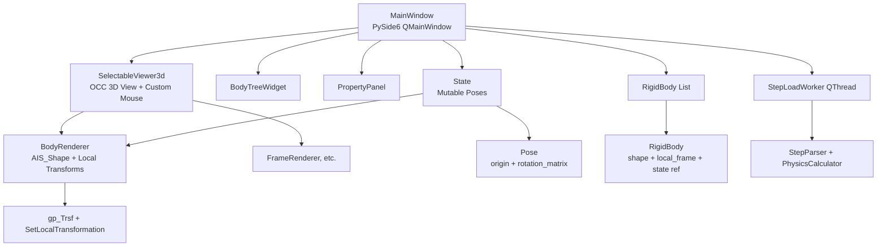
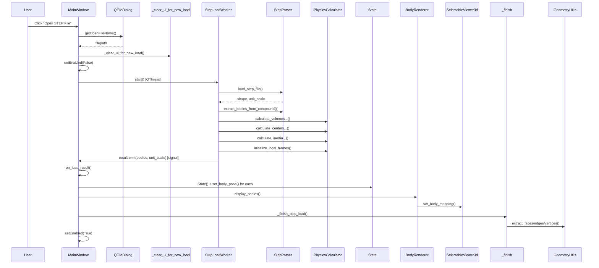
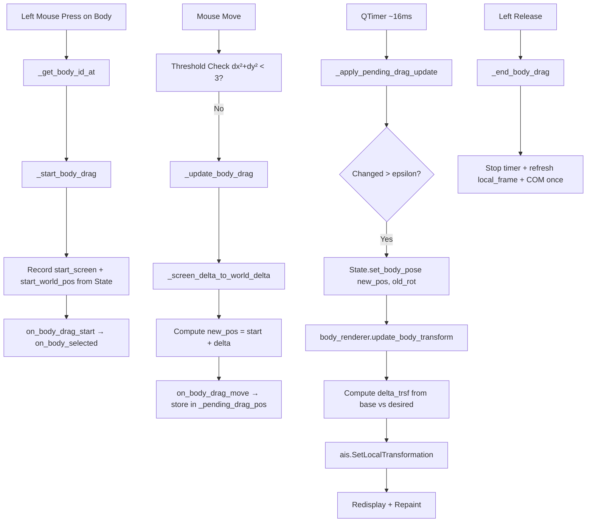
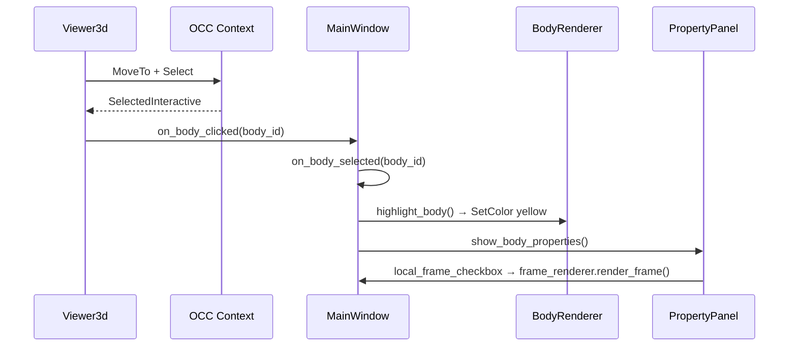
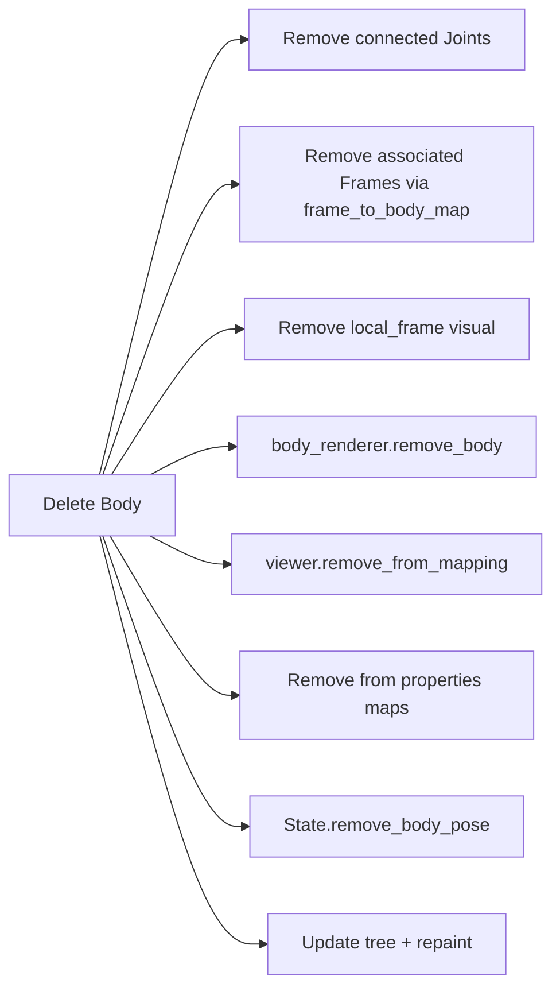

# MBD Pre-Processor - Execution Flow & Architecture Documentation

**Purpose**  
This document focuses on **runtime execution flows** and **internal architecture** rather than traditional API reference. It provides:

- Visual diagrams (Mermaid)
- Step-by-step call traces with explanations
- Data structure creation and mutation details
- Design rationale ("why" things are implemented this way)
- Threading considerations

The goal is to help developers understand the **end-to-end behavior** when a user interacts with the application.

---

## High-Level Architecture



**Key Design Principle**:  
Geometry (`TopoDS_Shape`) is **immutable** after loading. All interactivity (position, orientation) lives in the separate mutable `State` object. Bodies hold a reference to `State` so they can query their live pose.

---

## 1. Loading a STEP File Flow

**User Action**: Menu → Open STEP File → select file → Open

### Sequence Diagram



### Detailed Execution Trace with Explanations

1. **Entry Point**  
   `MainWindow.open_step_file()` (triggered from QAction)  
   → Shows native file dialog.

2. **Clearing Phase** (`_clear_ui_for_new_load`)  
   Everything from previous session is wiped on the **main thread** before starting the worker.  
   This includes:
   - All `AIS_Shape` objects (via `body_renderer.clear_all()` → `EraseAll`)
   - `self.bodies = []`
   - `self.assembly_state = None`
   - All user frames, joints, forces, torques
   - Drag state and timer

   **Why?** To avoid mixing data from two different assemblies.

3. **Background Worker** (`StepLoadWorker.run()`)  
   Heavy work runs off the main thread so the UI doesn't freeze.

   - `StepParser.load_step_file()` → returns `(TopoDS_Shape, float unit_scale)`
   - `StepParser.extract_bodies_from_compound()` → creates `List[RigidBody]`
   - Four sequential calls to `PhysicsCalculator`:
     - `calculate_volumes_for_bodies()` → populates `RigidBody.volume`
     - `calculate_centers_of_mass_for_bodies()` → populates `center_of_mass`
     - `calculate_inertia_tensors_for_bodies()` → populates `inertia_tensor`
     - `initialize_local_frames()` → creates `RigidBody.local_frame` (Frame at COM with identity rotation)

   **Data at this point**: RigidBody objects now have geometry + physical properties + a `local_frame`, but **no world pose yet**.

4. **State Creation (on main thread)**  
   ```python
   self.assembly_state = State()
   for body in bodies:
       self.assembly_state.set_body_pose(body.id, body.local_frame.origin, identity)
       body.state = self.assembly_state
   ```
   This is the moment the **mutable pose system** is born. From now on, the body's position in the world comes from `State`, not from the original STEP coordinates.

5. **Rendering**
   - `body_renderer.display_bodies()` creates one `AIS_Shape` per `RigidBody.shape`.
   - These AIS objects are stored with identity local transform initially.
   - Later, `update_body_transform()` will apply deltas based on `State`.

6. **Post-Load Work** (`_finish_step_load`)
   - Face/edge/vertex property extraction (for selection).
   - Bounding box calculation → dynamic scaling of axes and markers.
   - Viewer mapping for picking.

**Resulting State**:
- `self.bodies` — list of fully populated RigidBody
- `self.assembly_state` — holds initial poses (matching the imported geometry)
- `self.body_renderer.body_ais_shapes` — visual objects ready for transformation

---

## 2. Direct Mouse Dragging a Body

**User Action**: Left-click on a body and drag.

### Flow Diagram



### Detailed Explanation

**Translation Math (the heart of 2D → 3D)**

The screen is 2D. The body has a 6DOF pose in `State`.

Current implementation only supports **translation** (3 DOF). Orientation is never changed by mouse drag.

```python
# In _screen_delta_to_world_delta
right = view_right_vector
up    = view_up_vector

world_per_pixel = (view_size * 2.0) / widget_width
delta = right * (dx * world_per_pixel) - up * (dy * world_per_pixel)
new_pos = start_world_pos + delta
```

- `right` and `up` come from the current camera orientation.
- This creates a translation **parallel to the screen** at the depth of the body's COM.
- Result: the body moves naturally with the mouse in the current view.

**Why only position, not rotation?**
- Pure 2D mouse deltas are ambiguous for rotation.
- Common solutions (not yet implemented here):
  - Modifier keys (Shift = rotate)
  - Virtual trackball
  - AIS_Manipulator gizmo (previously removed per request)

**State Update**
```python
self.assembly_state.set_body_pose(body_id, new_pos, current_rotation)
```
Only the `Pose.origin` changes. The rotation matrix stays exactly as it was.

**Visual Update**
`update_body_transform` never touches the original `body.shape`. It calculates:

```python
delta_rot = desired.rot @ base.rot.T
delta_origin = desired.origin - (delta_rot @ base.origin)
trsf = _pose_to_trsf(delta_origin, delta_rot)   # in model units
ais.SetLocalTransformation(trsf)
```

This is why dragging feels "live" without reloading geometry.

**Performance Notes (why we added throttling)**
- Without the QTimer + epsilon check, every mouse pixel would trigger `SetLocalTransformation` + `Redisplay` + `Repaint`.
- The timer caps updates at ~60 FPS.
- The epsilon (`1e-5` meters) prevents micro-updates that cause stuttering.

---

## 3. Body Selection Flow (Viewer Click)



**Important Detail**:
When you left-click a body, both drag-start and selection logic run. The release event decides whether it was a "click" or a "drag" based on whether `_dragging_body_id` was set.

---

## 4. Face Selection Flow

1. User changes mode in `PropertyPanel` → `selection_mode_changed` signal
2. `viewer_3d.set_selection_mode("Face")` → `ctx.Deactivate()` + `Activate(ais, 4)` for all bodies
3. Click → `_select_at_position` → extracts sub-shape index using `TopExp_Explorer` on `body.shape`
4. `on_face_clicked(body_id, index)` → looks up pre-computed `FaceProperties` → highlights + shows in panel

**Pre-computed Data**:
Face/edge/vertex properties are extracted once after loading (in `_finish_step_load`) because extraction is relatively expensive.

---

## 5. State vs Local Frame Relationship

This is a common point of confusion.

- `RigidBody.local_frame`: The body's **intrinsic** coordinate system (usually COM + identity or body axes). Computed once at load.
- `State.body_poses[id]`: The body's **current placement** in world space. This is what changes when you drag.

When you drag:
- We update `State`
- We also mirror the change into `body.local_frame.origin` (for convenience with existing code that reads local_frame)
- The visual transform is always derived from `State` via `update_body_transform`

---

## 6. Deletion Flow (High Level)



---

## Additional Notes & Design Decisions

- **Why State is separate from RigidBody**  
  Allows the same geometry to be placed differently without copying or transforming the heavy `TopoDS_Shape`.

- **Why delta transforms instead of absolute**  
  The original geometry from STEP is in arbitrary world coordinates. We record the "base" placement at load time and only ever apply *deltas* from that base. This keeps the math stable.

- **Threading in loading**  
  Physics calculations can be slow on complex models. They are deliberately moved to `QThread` so the UI stays responsive. All OCC display work still happens on the main thread.

- **No full 6DOF mouse rotation yet**  
  Current mouse drag is deliberately translation-only in the view plane. Adding rotation would require either:
  - Modifier keys + rotation math, or
  - Re-introducing a manipulator (gizmo)

Would you like me to expand any specific flow with even more detail, add more diagrams (e.g., for export or joint creation), or add a section on "How to extend dragging to support rotation"?

This version should now feel much more explanatory and visual.