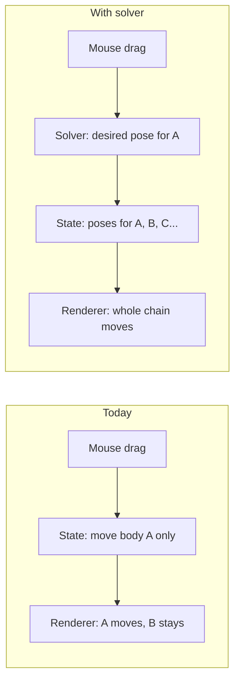
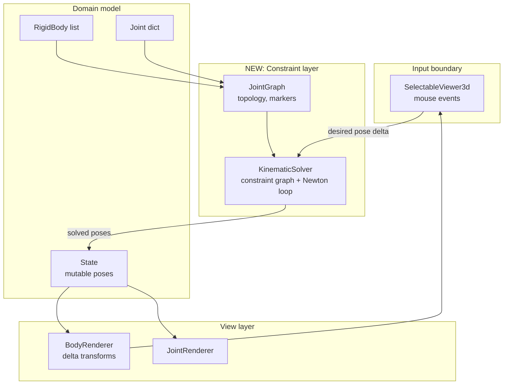
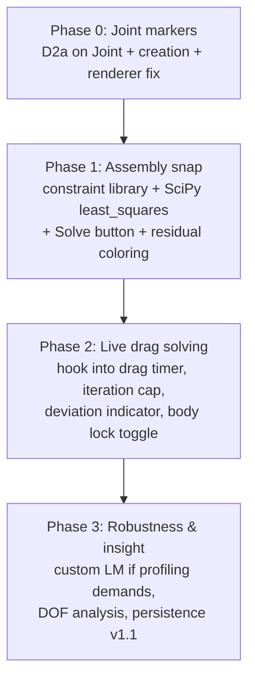

# Kinematic Solver — Design & Implementation Plan

**Status:** Design proposal (not yet approved for implementation)
**Date:** 2026-07-18
**Scope:** Add a position-level kinematic constraint solver to the MBD Pre-Processor so that dragging one body moves all kinematically-connected bodies in accordance with their joint definitions, and so that an assembly can be "snapped" to a constraint-satisfying configuration.

> This document is a **decision plan**, not a task list. Every significant choice is presented with its options, trade-offs, and a recommendation. Nothing here is final until the choices in §3 are made.

---

## 1. What "a kinematic solver" means here

The app already has:
- Bodies with mutable 6DOF poses (`State.body_poses`).
- Joints (`FIXED, REVOLUTE, PRISMATIC, CYLINDRICAL, SPHERICAL`) connecting two bodies (or body↔ground, `body_id == -1`).
- A direct-manipulation loop: mouse → `State` → renderer delta-transform → visual.

What it does **not** have: any notion that moving body A should move body B because a joint connects them. Today each body drags independently, and joint frames are pure visual annotations.

**A kinematic solver, in this context, is the component that answers:**
> "Given the current joint graph and a desired pose for one body (from the mouse), what poses must all other bodies take so that every joint constraint is satisfied?"

This is **position-level assembly solving** (a.k.a. kinematic constraint satisfaction, or IK over a joint graph). It is *not* dynamics (no mass, inertia, force, or time integration). Those already-computed properties (COM, inertia) are irrelevant to this solver and remain for the downstream simulator.

---

## 2. Systems-thinking view

The solver is not a bolt-on function; it is a new **feedback loop** that sits between input and state. Understanding where it lives in the system's causal structure determines whether it feels "alive" or "bolted on."

### 2.1 Where the solver sits (new boundary)

**Key architectural claim:** the solver must *write* `State` through the same `set_body_pose()` path the drag handler uses today, and the renderer must consume it through the existing `update_body_transform()`. If we keep that contract, the entire view layer works unchanged — the solver becomes just another source of pose mutations. This is the highest-leverage design decision in this plan.

### 2.2 Feedback loops introduced

1. **Constraint-propagation loop (reinforcing, the feature itself):**
   mouse delta → desired pose → solver → multi-body poses → visuals → user sees the *mechanism* move → continues dragging.

2. **Stability loop (balancing, the risk):**
   solver fights user when constraints are unsatisfiable → jitter or snapping → user loses trust. Mitigated by damped iterations, convergence tolerance, and clear visual feedback when the system is over/under-constrained.

3. **Authority loop (balancing):**
   the user expects to be the ultimate authority. If the solver *silently overrides* a pose the user explicitly set, the tool feels broken. Mitigated by "ghost" preview + explicit solve modes (§3, Decision D6).

### 2.3 Leverage points (where small changes have large effects)

| Leverage point | Effect if changed |
|---|---|
| Marker formulation (how joints map to constraints) | Correctness of everything downstream |
| Where the solver hooks the drag loop (`_apply_pending_drag_update`) | Whether solving feels live or batch |
| Convergence tolerance / damping | Feel: snappy vs. mushy vs. jittery |
| Freeze policy (which bodies are allowed to move) | Whether the solver is predictable |
| Constraint residuals exposed to UI | Debuggability of "why won't this assemble" |

### 2.4 Emergence

"Dragging a four-bar linkage and watching it articulate" is not implemented in any single function. It emerges from: correct marker math + a damped Newton loop + writing through State + the existing delta-transform renderer + throttled repaint. If any one is wrong, the behavior collapses (bodies fly apart, freeze, or jitter).

---

## 3. Decision matrix — every choice with its options

Each decision lists options, trade-offs, and a **recommendation**. Decisions are roughly ordered: earlier ones constrain later ones.

---

### D1 — Solver scope: what problem are we actually solving?

| Option | Description | Pros | Cons |
|---|---|---|---|
| **D1a. Assembly snap only** | One-shot "solve" button: adjust all poses so constraints are satisfied. No solving during drag. | Simplest; no real-time perf pressure; solves the "my import is slightly off" case | Not interactive; doesn't demo the "mechanism moves" wow-factor |
| **D1b. Drag-time solving only** | Solve while dragging; no explicit snap command. | Interactive; the compelling case | Needs to run at ~30–60 Hz; needs good damped convergence from arbitrary start |
| **D1c. Both (snap + live drag)** | Same solver core, two entry points. | Snap doubles as drag's initial-condition repair; shared core means little extra cost | Slightly more UI work |

**Recommendation: D1c.** The solver core is identical; the only difference is whether it runs once on demand or repeatedly inside the drag timer. Building D1a first is the natural milestone, and D1b is then a thin hook. This sequencing also gives a testable artifact before any real-time pressure exists.

---

### D2 — Constraint formulation: how joints become equations

The current `Joint` stores **one shared world-coordinate `Frame`** plus an `axis` string. A solver needs each joint expressed as **two markers**: the joint frame fixed in body 1's local coordinates, and the joint frame fixed in body 2's local coordinates. Constraints then say how the two *currently-transformed* markers relate.

| Option | Description | Pros | Cons |
|---|---|---|---|
| **D2a. Two-marker capture at joint creation** | When a joint is created, compute `M1 = T1⁻¹ · J_world` and `M2 = T2⁻¹ · J_world` from the poses *at that instant* and store them on the joint. | Standard formulation (used by MBDyn, Chrono, Exudyn); joints then *move with bodies* naturally; dragging after joint definition works | Requires changing `Joint` (add `marker1`, `marker2`); needs bodies to be posed before joint creation |
| **D2b. Single shared world marker, frozen** | Keep today's single world frame; constraints reference it directly. | Zero change to `Joint` | Breaks the moment any body moves — the joint frame stays behind in world space. Only viable for D1a with bodies that never move after jointing. Effectively rules out live dragging |
| **D2c. Derive markers lazily on first solve** | Compute `M1`, `M2` from current poses the first time the solver runs. | No change to creation flow | Ambiguous if bodies moved between joint creation and first solve — which poses were "the joint definition"? Hidden state, hard to reason about |

**Recommendation: D2a.** It is the industry-standard two-marker formulation, makes joints first-class citizens of the pose system (they stop being world-space decorations), and is the only option consistent with live dragging. The migration cost is small: add two `Frame` fields to `Joint`, populate them in `create_joint()` from the bodies' current `State` poses, and update `JointRenderer` to draw the markers at their *current* world positions (`T1·M1` / `T2·M1`) — which also fixes the existing "joint frame gets left behind when you drag" bug as a side effect.

**Axis handling:** the `axis` string (`"+Z"` etc.) is interpreted *relative to the joint frame*. With two markers, each marker carries the full frame; the axis selects which marker axis is the motion axis. This maps cleanly: revolute/prismatic/cylindrical constrain the two markers so that their chosen axes coincide (direction for revolute, direction + line for prismatic/cylindrical).

---

### D3 — Constraint equations per joint type (position level)

Using body world transforms `T1, T2` and markers `M1, M2`, the "joint points" in world are `P1 = T1·M1`, `P2 = T2·M2`. Residuals (must → 0):

| Joint | Constraints | Count | Residual sketch |
|---|---|---|---|
| FIXED | `P1 = P2` (position + orientation) | 6 | position diff (3) + orientation diff (3, via rotation parametrization) |
| REVOLUTE | origins coincide; motion axes parallel | 5 | origin diff (3) + axis alignment (2, cross-product ⊥ components) |
| PRISMATIC | motion axes collinear; orientation locked | 5 | point-to-line (2) + full orientation lock (3) |
| CYLINDRICAL | motion axes collinear | 4 | point-to-line (2) + axis alignment (2) |
| SPHERICAL | origins coincide | 3 | origin diff (3) |

**Decision:**

| Option | Description | Pros | Cons |
|---|---|---|---|
| **D3a. Full Cartesian (6-DOF-per-body) coordinates** | Unknowns = each body's 6 pose DOF; every joint removes DOF via equations above. | Simple, uniform, handles closed loops and any joint mix; standard for assembly solvers | Redundant coordinates → need least-squares / damped solve; rotation parametrization choice matters |
| **D3b. Minimal (joint-space) coordinates** | Unknowns = joint angles/displacements; body poses computed by forward kinematics along a spanning tree. | No constraint violation possible along tree; few unknowns | Closed loops need cut-joint constraints anyway; much more bookkeeping; bodies not on a tree branch are awkward; poor fit for an interactive GUI where user grabs arbitrary bodies |
| **D3c. Hybrid: tree FK + loop closure** | Tree for open chains, constraints only for loops. | Efficient | Complex; overkill for a pre-processor with ≤ a few dozen bodies |

**Recommendation: D3a (full Cartesian).** It is the standard assembly-solver formulation (this is exactly what SolveSpace, FreeCAD assembly workbenches, and most MBS codes do at the position level), tolerates redundant/over-constrained input gracefully via damped least squares, and treats ground as just a body with all 6 DOF removed. Closed loops — the hard case for D3b — are free.

---

### D4 — Numerical method

With D3a, we solve `F(q) = 0` where `q` is stacked body poses and `F` stacks all joint residuals. Generally over/under-determined, so use a least-squares formulation `min ‖F(q)‖²`.

| Option | Method | Pros | Cons |
|---|---|---|---|
| **D4a. Damped Newton–Raphson (Levenberg–Marquardt) with analytic Jacobians** | Per-joint Jacobian blocks written by hand; LM damping handles redundancy/singularity | Fast (quadratic near solution), robust for assembly, what SolveSpace-style solvers do; deterministic iteration count for the drag loop | Must derive/implement Jacobians for 5 joint types (well-documented in MBS literature); rotation parametrization care |
| **D4b. `scipy.optimize.least_squares`** | Hand residuals to SciPy, let it do trust-region LM; numeric or analytic Jacobian | Almost no solver code; battle-tested; already have scipy as a dependency | Per-call overhead higher; less control over step size for live dragging; numeric Jacobians slow for many bodies |
| **D4c. Projected Gauss–Seidel / sequential constraint projection** | Satisfy joints one at a time, iterate | Very simple; stable; easy per-iteration cost cap for real-time | Slow convergence for loops; ordering artifacts; can look "rubbery" |
| **D4d. External solver library (SolveSpace via python-solvespace, Pinocchio IK, Drake, CasADi, etc.)** | Map our joint graph to the library's constraint system | See §4 (library landscape) for per-library details | Adds dependency + impedance mismatch with our Joint model; see §4 |

**Recommendation: D4b for Milestone 1 (assembly snap)** — fastest path to a correct, testable solver with essentially zero numerical code, and `scipy` is already in `requirements.txt`. **Then evaluate D4a for Milestone 2 (live drag)** if profiling shows SciPy overhead is too high for 30–60 Hz on typical assemblies (it often is fine to ~10–20 bodies). D4a is the "if we outgrow it" path, not the starting point. D4d is analyzed in §4; the short version is that no external library matches our joint model closely enough to beat D4b on total integration cost for this app's scale.

---

### D5 — Rotation parametrization inside the solver

Newton needs a minimal, singularity-managed update for orientation.

| Option | Description | Pros | Cons |
|---|---|---|---|
| **D5a. Rotation-vector updates on SO(3)** (`q ← q ⊕ δω`, exp map) | Store pose as matrix/quaternion; update via 3-vector Lie-algebra increment | Standard, no singularities in update step; 3 params per body orientation | Must implement exp/log maps (small, well-known) |
| **D5b. Quaternion with normalization** | 4 params + norm constraint | Simple | Slightly larger system; needs constraint or renormalize each step |
| **D5c. Euler angles** | 3 params | Matches UI | Singularities; bad for solver (fine for display only) |

**Recommendation: D5a.** It is the textbook approach for MBS Newton updates (and what SciPy `least_squares` pairs with naturally via `scipy.spatial.transform.Rotation` exp/log). Display continues to use matrices/Euler via existing `Frame` helpers.

---

### D6 — Interaction model: how the solver meets the user

| Option | Description | Pros | Cons |
|---|---|---|---|
| **D6a. Dragged body is authoritative, others follow** | Mouse sets desired pose for dragged body; solver moves all connected bodies to satisfy constraints, treating dragged body as fixed input | Matches mental model of "grab and pull a mechanism"; direct extension of current drag | If constraints conflict with desired pose, dragged body can't reach the mouse → must show deviation |
| **D6b. Solve-after-release** | Drag freely as today; on mouse-release, snap the whole assembly to the nearest valid configuration | No real-time pressure; simple | Feels "rubber-bandy"; body jumps at release; hides constraint info during drag |
| **D6c. Ghost/preview mode** | Drag shows unconstrained ghost; a translucent preview shows the solved configuration live; commit on release | Maximum information; honest about constraints | Two renders per body; visual complexity |
| **D6d. Explicit solve button only** | No drag integration | Trivial | Not interactive |

**Recommendation: D6a with a deviation indicator**, falling back to D6b behavior when the solver fails to converge. Concretely: during drag, the dragged body follows the mouse only as far as constraints allow; the residual distance between mouse-desired pose and achievable pose is shown (e.g. color the dragged body, or draw a dashed line to the mouse target). This preserves user authority (the mouse target is the intent) while keeping the mechanism valid. D6b is the cheap fallback and is automatically available since it is just D1a triggered at drag-end.

---

### D7 — Freeze / ground policy (which bodies the solver may move)

| Option | Description | Pros | Cons |
|---|---|---|---|
| **D7a. Ground fixed; all others free** | Only body `-1` is locked | Zero UI | Solver may "walk" the whole assembly away from where the user expects it |
| **D7b. Ground + user-frozen bodies** | Add per-body "lock" toggle (tree checkbox); locked bodies contribute no unknowns | Predictable; standard in CAD assembly ("fix component") | Small UI addition; solves most "the base moved!" surprise |
| **D7c. Auto-grounding** | Solver picks a root (e.g. largest body or first joint body) as fixed each solve | No UI needed | Non-deterministic feel; surprises |

**Recommendation: D7b**, defaulting to ground locked. A lock toggle per body is cheap (the tree already has per-body rows and checkboxes for visibility), and it doubles as the mechanism for defining "the frame of the machine." This also gives users direct control over under-constrained systems: lock what should not move, and the solver has a well-posed problem.

---

### D8 — Over/under-constrained handling and feedback

| Option | Description |
|---|---|
| **D8a. Silent damped least-squares** | Always return the minimum-residual answer. Simple, but user can't tell a 1e-12 solution from a 5 mm error. |
| **D8b. Residual reporting** | Expose per-joint residual norms; color joints in the tree (green/yellow/red) and surface "unsatisfied" state after solve. |
| **D8c. DOF analysis** | Compute and display the mechanism's mobility (Grübler count or numeric rank of the Jacobian): "this assembly has 2 DOF." |

**Recommendation: D8b now, D8c later.** Per-joint residual coloring is cheap (the tree already lists joints) and turns solver failures from mystery into information. Full mobility analysis (D8c) is a genuinely useful second-phase feature — rank of the assembled Jacobian at the solution gives numeric DOF — but is not required for the first useful solver.

---

### D9 — Where the solver code lives

| Option | Layout |
|---|---|
| **D9a. New `core/kinematics/` package** | `markers.py` (marker math), `constraints.py` (per-joint residuals + Jacobians), `graph.py` (topology, connectivity from dragged body), `solver.py` (Newton/SciPy driver). Clean separation, unit-testable without GUI. |
| **D9b. Extend `core/physics_calculator.py`** | Reuses existing module but mixes physics (mass properties) with kinematics (constraints) — different concerns. |
| **D9c. Inside `main.py`** | Worst: 2000-line file grows, no testability. |

**Recommendation: D9a.** It mirrors the existing `core/` structure, keeps every solver function pure (numpy in, residuals/poses out), and allows the test suite to exercise constraint math headlessly — essential, since GUI drag testing is impractical.

---

### D10 — Threading model for live drag

| Option | Description | Pros | Cons |
|---|---|---|---|
| **D10a. Solve on main thread inside the existing drag timer tick** | Reuse `_drag_update_timer` cadence | Simple; poses + rendering stay on one thread (matches today's invariant that State mutation + display happen on main) | A slow solve (big assembly) stalls UI |
| **D10b. Worker thread for solve, main thread for State/render** | Mirror `StepLoadWorker` pattern | UI never stalls | Pose hand-off synchronization; solver sees a snapshot while user keeps dragging → lag/coherence issues; significant complexity |
| **D10c. Iteration-capped main-thread solve** | D10a + hard cap on Newton iterations per tick (e.g. 4–8); unconverged state still renders | Bounded worst-case per tick; degrades gracefully to "laggy but responsive"; simple | Large loops may visibly trail the mouse |

**Recommendation: D10c.** It respects the existing threading boundary (all State mutation and display on main thread), needs no synchronization, and the iteration cap converts worst cases into graceful degradation. Benchmarks on realistic assemblies (≤ ~20 bodies, a handful of joints) should put a capped solve comfortably within a 16–33 ms tick; if not, D10b remains a later optimization. Note the existing drag already uses an epsilon + timer throttle — the solver slots into the same dampening design.

---

### D11 — Persistence: joints and markers in `.mbdp` and JSON export

The project file today serializes joints with their *world* frame. With D2a, joints gain body-local markers.

| Option | Description |
|---|---|
| **D11a. Store markers; keep world frame for backward compat** | `.mbdp` v1.1: write `marker1`, `marker2` (body-local) plus existing fields; on load, prefer markers, else recompute from world frame + current poses. Export JSON gains the same fields. |
| **D11b. Store only world frame (as today)** | On load, markers are recomputed from whatever poses bodies have after load — which, once poses are also persisted (see the separate pose-persistence gap), is the solved configuration. Acceptable, but fragile if pose persistence isn't done. |

**Recommendation: D11a**, with a version bump and a fallback path. It is a few lines of serialization and removes an entire class of "loaded project assembles differently" bugs. (Related but out of scope for this plan: body poses themselves are not currently persisted in `.mbdp` — the solver makes that gap more visible, since a saved assembly should reload in its solved configuration.)

---

### D12 — Testing strategy

| Layer | Tests |
|---|---|
| **Unit (headless, pytest-style, matching `tests/run_unit_tests.py`)** | Marker capture math; each joint type's residual at a known-valid configuration ≈ 0; residual nonzero at known-invalid; Jacobian vs. finite-difference check; ground handling; over-constrained least-squares sanity |
| **Golden configurations** | Hand-built 2–3 body mechanisms (pendulum: ground+body+revolute; slider: ground+body+prismatic; four-bar: ground+3 bodies+4 revolute, a closed loop) with known solutions; assert solver converges and residuals < tol |
| **Integration** | Solve via `State`, verify `update_body_transform` path unchanged; joint creation populates markers |
| **Manual/UI** | Drag a four-bar; lock/unlock bodies; observe residual coloring |

**Recommendation:** golden four-bar is the critical test — it is the smallest closed loop and exercises everything that makes D3a worth choosing. Finite-difference Jacobian validation catches 90 % of constraint-math bugs early.

---

## 4. Solver library landscape (inspiration & external options)

Before writing constraint math from scratch, we surveyed what the current ecosystem offers. Two questions mattered: (a) does it do **position-level constraint solving** (assembly/IK), not just dynamics; and (b) can it be embedded in a PySide6 + numpy desktop app without swallowing the architecture?

### 4.1 What the established tools actually do

**SolveSpace / py-slvs — the closest philosophical match.**
SolveSpace is a parametric CAD tool whose heart is a small, fast geometric-constraint solver. It works exactly like our D3a choice: full-Cartesian entities, constraints (coincident points, parallel, point-on-line, equal distance...) each contributing residual rows, and a damped Newton (modified Levenberg–Marquardt) loop driving them to zero. It is proven on precisely the "drag a mechanism and watch it articulate" interaction we want — SolveSpace's own UI lets you grab a point and pull a linkage. The `py-slvs` bindings (https://pypi.org/project/py-slvs/, maintained in the realthunder fork for FreeCAD's Assembly3) expose that solver to Python. **Inspiration value: high** (it validates D3a + D4a and shows the interaction works). **Dependency value: moderate** — its entity model (points/lines/normals/workplanes) is sketch-centric; mapping our marker-pair joint semantics onto it is possible but adds an impedance-mismatch layer, and the binding's packaging is less mainstream than scipy.

**FreeCAD assembly workbenches (A2plus, Assembly3, Assembly4) — proof of the workflow at desktop scale.**
These solve the same user problem we have (imported parts, mate them, drag). Assembly3 embeds the SolveSpace solver via `py_slvs`; A2plus ships its own Python constraint solver. The key takeaway is architectural and matches our D9/D2 choices: they keep a **separate constraint layer** above the document objects, store **placement** (pose) on each part, and define mates as **pairs of local coordinate systems** on the two parts — i.e. exactly the two-marker formulation of D2a. They also all ship a "solve" button (our D1a) before/instead of live-drag solving, confirming the phased approach in §5.

**Exudyn — full MBS, heavier than we need.**
A C++/Python multibody dynamics code (https://github.com/jgerstmayr/EXUDYN, active, GPL-style license). It *can* do static/kinematic position solving and has the joint types we need, with proper marker-based joint definitions. But it is a dynamics engine first: to use it we would model bodies/markers/joints in *its* object system and run *its* solver, then read positions back — a large conceptual and dependency footprint for what is fundamentally a small least-squares problem. **Inspiration value: high** (its joint/marker formulations are well documented in `theDoc.pdf` and map directly onto our D3 table). **Dependency value: low** for this app.

**MBDyn — research-grade MBS, text-input, not embeddable as a library.**
The venerable free MBS solver (https://www.mbdyn.org, GPL). It has an experimental "initial assembly" mode — precisely our D1a problem — and its joint library (revolute, prismatic, cylindrical, spherical, fixed, all marker-based) is a reference implementation of the D3 constraint table. But it is a standalone solver driven by input files, not a library we would link into a GUI. **Inspiration value: high** (joint math, initial-assembly concept). **Dependency value: none.**

**Pinocchio (+ Pink) — robotics IK, minimal coordinates.**
Pinocchio (https://stack-of-tasks.github.io/pinocchio) is a fast rigid-body library; Pink (https://github.com/stephane-caron/pink) builds differential IK on top using task residuals and a QP. This is the robotics flavor of our problem, but it assumes a **kinematic tree in minimal (joint) coordinates** — our D3b, which we rejected for an interactive GUI with arbitrary grabs and closed loops. **Inspiration value: moderate** (the "task = residual driven to zero" framing is the same idea as our per-joint residuals, and their frame-attachment model is clean). **Dependency value: low** (wrong coordinate philosophy for closed-loop assemblies).

**scipy.optimize.least_squares — already in our stack.**
Trust-region Levenberg–Marquardt / dogleg over user-supplied residuals and (optionally) Jacobians, bounded and robust. For the number of unknowns we have (6 × bodies, typically < ~150), it is entirely adequate and is **zero new dependency** — `scipy` is already in `requirements.txt`. This is the engine behind D4b.

### 4.2 Comparison table

| Candidate | Position-level assembly solving? | Our joint types? | Coordinate model | New dependency weight | Fit as dependency | Fit as reference |
|---|---|---|---|---|---|---|
| **scipy least_squares (custom residuals)** | Yes (via our residuals) | All 5 (we write them) | Full Cartesian (D3a) | None (already present) | **High** | — |
| **py-slvs / SolveSpace** | Yes (its core purpose) | Mappable, sketch-centric | Full Cartesian | Medium (C++ binding) | Medium | **High** |
| **Exudyn** | Yes (static/kinematic) | Yes, marker-based | Full Cartesian | High (dynamics engine) | Low | **High** |
| **MBDyn** | Yes ("initial assembly") | Yes, marker-based | Full Cartesian | Not embeddable | None | **High** |
| **Pinocchio / Pink** | IK, yes | Via URDF joints | Minimal / joint-space | Medium–high | Low | Medium |
| **FreeCAD Asm3/A2+ solvers** | Yes | Mate-based | Full Cartesian | Not separable from FreeCAD | None | **High** |

### 4.3 Conclusion from the landscape

The survey **strengthens the recommendations in §3** rather than overturning them:

- Every serious assembly solver (SolveSpace, Exudyn, MBDyn, FreeCAD workbenches) uses **full-Cartesian coordinates + marker-pair joints + a damped Newton loop** — i.e. D2a + D3a + D4. Our instinct matches the field.
- The differentiator is that our problem is **small** (tens of bodies, five joint types, no dynamics). All the heavy external options earn their complexity budget on features we will never use (flexible bodies, contact, time integration, URDF pipelines). The right-sized solution is a **small custom solver on scipy** (D4b), with the SolveSpace/Exudyn/MBDyn joint formulations as our correctness reference, and the option to hand-roll LM Jacobians (D4a) if profiling demands it.
- We keep `py-slvs` as the designated **fallback dependency**: if the custom solver's convergence proves hard to get right on messy real assemblies, wrapping SolveSpace's battle-tested solver is the lowest-risk external integration. **Caveat:** py-slvs / SolveSpace is **GPLv3** — adopting it as a dependency is a licensing decision, not just a technical one, and only viable if this project is GPL-compatible.
- **CasADi** is the named **upgrade path**: if we later want free automatic-differentiation Jacobians, sensitivity analysis, or trajectory optimization, it solves the same Φ(x)=0 with AD for free (LGPL-3, linkable — a softer licensing constraint than SolveSpace's GPL).
- The canonical mathematical reference for the formulation we chose (absolute 6DOF body coordinates + Newton/LM on stacked joint residuals) is **Haug, *Computer-Aided Kinematics and Dynamics of Mechanical Systems*** — the standard text behind ADAMS-style solvers.

A full per-library survey (14 libraries: license, maintenance status, joint coverage, numerics, dependency weight) lives alongside this plan in **`kinematics_solver_survey.md`** at the repo root. Its independent conclusion matches this plan: custom Newton/LM on `scipy.optimize.least_squares` ranked #1, py-slvs #2 (GPL-flagged), CasADi #3.

### 4.4 SolveSpace internals worth copying

SolveSpace's `slvs` core is the proven, battle-tested implementation of exactly our chosen approach. Three of its design ideas should shape our solver (Phase 2/3):

1. **Group decomposition.** It splits the parameter/constraint graph into "groups" solved sequentially in dependency order, turning one large system into several small ones. Our analog: run union-find over the body–joint graph and solve connected subassemblies independently — a body group with no joints path to the dragged body need not be solved at all during a drag. Cheap to implement, large win on multi-mechanism scenes.
2. **Redundancy reporting.** After solving, it computes the Jacobian rank and can name *which* constraints are redundant (by removal tests). This "your sketch is over-constrained, and here's the offending constraint" feedback is the killer CAD-solver UX feature — it maps directly onto our D8b per-joint residual coloring, and the rank computation is nearly free once we have an assembled Jacobian.
3. **Dragged-entity pinning.** A dragged point is handled as just another (temporary, high-weight) constraint. This validates our D6a "dragged body is authoritative" model: the mouse target is simply a soft constraint the solver balances against the joint constraints.

---

## 5. Phased implementation outline (post-decision)

Only after §3 decisions are made. Sketch of phases, each independently useful:

- **Phase 0** is valuable on its own: it fixes joints being left behind by drags.
- **Phase 1** delivers the first solver value (fix my assembly) with no real-time constraints.
- **Phase 2** delivers the headline interactivity.
- **Phase 3** is performance/insight polish, driven by measurements from Phase 2.

---

## 6. Risks

| Risk | Mitigation |
|---|---|
| Constraint math bugs (wrong Jacobians) → bodies explode/freeze | Finite-difference Jacobian tests; golden four-bar; residuals visible in UI |
| Real-time solve too slow on big assemblies | Iteration cap (D10c); profile before optimizing; D4a escape hatch |
| User confusion when solver overrides motion | Deviation indicator (D6a); lock toggle (D7b); solve is always explainable via per-joint residuals |
| Over-constrained legacy projects | Damped least-squares degrades gracefully; residual coloring flags the offending joints |
| Scope creep into dynamics | Explicit non-goal: no forces, no time integration. Inertia/COM remain export-only data. |
