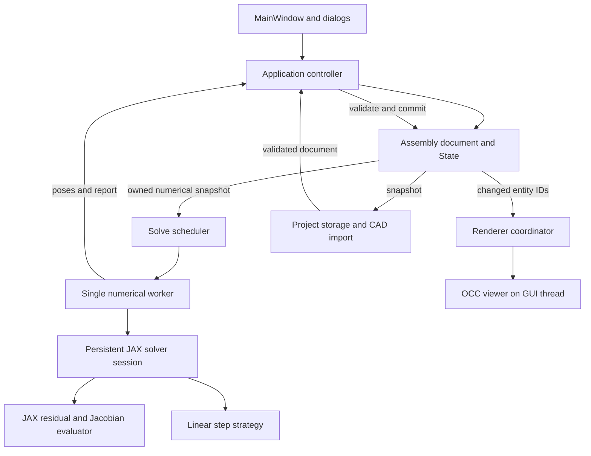

# Refactoring plan: assembly architecture and JAX GUI integration

Date: 3 October 2026  
Status: Implementation plan; application code has not been changed by this document.

## 1. Goal and scope

Make the application easier to maintain and keep the GUI responsive as assemblies grow. Remove the original NumPy `KinematicSolver` implementation and make the existing JAX evaluator part of the only production kinematic solver, used by both dragging and Solve Assembly.

The migration will retain the existing joint equations, weights, damping policy, tolerances, and graph selection rules initially. This makes it possible to check whether a behavior change comes from the refactor or a later numerical improvement. Changes to the linear solve will be measured separately.

Removing the legacy solver does not mean removing NumPy. The existing JAX path compiles constraint evaluation while its shared iteration engine uses NumPy buffers and a NumPy dense linear step. NumPy also remains useful for document data, CAD conversions, and export. This plan distinguishes switching to the JAX-backed solver from moving the entire numerical loop into JAX.

## 2. Architecture



The GUI asks for changes. The document owns the data. The worker calculates results using its own arrays. The controller checks those results before committing them. Renderers display committed data and never decide the physical state.

| Part | Responsibility | Reason for this boundary |
|---|---|---|
| Assembly document | Bodies, joints, attached frames, forces, torques, live poses, IDs, and revisions | One authoritative record prevents different widgets and services from maintaining conflicting copies. |
| Application controller | Create/delete/edit operations; route solving and loading; commit accepted results | Removes relationship management and computation policy from `MainWindow`. |
| Solve scheduler | One active request and one replaceable pending drag target | Keeps mouse input from building an ever-growing backlog. |
| Numerical worker | Own the solver session, prepared arrays, work buffers, and compilation cache | Compiled work survives across requests; writable numerical arrays are never shared concurrently. |
| Renderer coordinator | Update objects identified by document changes; request one viewer update per batch | Avoids repeated collection scans and centralizes visual synchronization. |
| Project storage/import | Serialize, migrate, validate, and load a document | Makes save/load independently testable and gives loading a defined completion point. |

Use ordinary Python services and Qt signals at the GUI boundary. A single-process desktop application does not need a distributed service architecture or a general-purpose event framework.

## 3. Decisions and why they were made

### A. Use one production JAX-backed solver

Promote the current `ExperimentSolver` implementation into the public `KinematicSolver`. Replace the old iterative implementation in `core/kinematics/solver.py`, retire `adapter.py`, and remove the `legacy` backend branch from the factory. Keep one public solver API rather than exposing experimental and legacy choices to the GUI.

Move `SolveReport` into `core/kinematics/reports.py` first. Both the current adapter and engine import it from the file containing the legacy solver; moving it breaks that dependency before removal. Add an explicit optional trace field instead of attaching `report.trace` dynamically.

JAX becomes a required application dependency. Verify a compatible Python, NumPy, SciPy, pythonocc, JAX, and jaxlib combination in the actual GUI environment and packaged application. Update installation instructions and the PyInstaller configuration. A missing JAX runtime should produce a clear installation error, without silently selecting another solver.

Why: one supported execution path makes GUI behavior, testing, dependencies, and debugging predictable.

### B. Keep a persistent session and make revisions explicit

Create one solver session per open document inside the numerical worker. Reuse prepared arrays, workspace capacity, and compiled functions. Closing or replacing the document releases that session.

Use distinct revision counters:

| Revision | Changed by | Consequence |
|---|---|---|
| Document generation | Open, close, or replace project | Reject results from the previous project. |
| Topology revision | Add/delete bodies or joints; change connectivity, types, or locks | Rebuild preparation and workspace when their layouts change. |
| Marker revision | Edit joint markers or axes | Refresh numerical inputs. |
| External pose epoch | Manual pose edit, reset, import, or undo | Reject calculations based on an obsolete starting state. |
| Pose revision | Commit a solver result | Notify consumers that displayed poses changed. |

All supported mutations go through document/controller methods. Numeric snapshots own their arrays; a frozen dataclass containing mutable arrays alone is not sufficient isolation. Replace per-drag full-model hashing with revisions once direct mutation paths have been removed. Retain signature checking for import validation and optional development assertions.

Why: repeated hashing is avoidable work, but removing it before controlling mutations would make cached data unreliable.

### C. Reuse compilation when marker values change

Refactor JAX kernels into stable functions with marker positions, marker rotations, axes, endpoint arrays, and joint types supplied as arguments. Cache by executable requirements such as shapes, dtypes, CPU device, and formulation. Store current marker/device arrays in the session and refresh them only when their revision changes.

The current code comments describe explicit inputs, but its kernels actually capture marker arrays in closures and key their cache by marker values. Replace that implementation, cap the cache, and release obsolete session references on project close. Do not promise that clearing Python references immediately returns all JAX runtime memory to the operating system.

Prewarm both evaluator kernels in the worker after preparation. The GUI should show a short preparing state and retain the latest drag target while compilation finishes. Benchmark compilation separately from warm execution.

Why: marker edits should not require a different function solely because numbers changed. Stable function identity and input shape are important to JAX compilation reuse. See [JAX compilation and caching](https://docs.jax.dev/en/latest/201/jit.html).

### D. Give live poses and attached frames one meaning

Keep `State` as the owner of body world poses. Store body reference geometry separately from current placement. Store attached frames and joint markers in body-local coordinates, with explicit attachment records. Calculate world frames from the body pose and local attachment through a shared transform helper.

Replace writes that copy current poses into `body.local_frame` with queries for the current world frame. Audit export and mesh coordinates as part of this change, because they currently read `local_frame` and COM values. Preserve the reference-pose-to-renderer delta transform used for baked CAD geometry.

Keep numerical document coordinates in meters and preserve the existing CAD-unit conversion at the import/render/export boundaries. Each frame must identify its parent and coordinate convention.

Why: one pose record prevents the display, solver, and export from disagreeing after movement. Transform logic needs to be shared, rather than copied into each consumer.

### E. Move computation out of the GUI, with bounded scheduling

Use one long-lived worker object in a Qt thread. The worker never reads widgets, updates AIS objects, or mutates the live document. Refactor the current solver adapter's direct `State` commit into a result containing owned pose arrays and a report; commit those arrays in the controller on the GUI thread.

For dragging:

1. Keep one active calculation and one pending target. A new mouse target replaces the pending target.
2. Include document generation, relevant revisions, gesture ID, and increasing request ID in requests and results.
3. Commit a finite result only if its model and external pose epoch still match, its gesture is valid, and its request ID is newer than the last committed result.
4. Accept useful intermediate results even if a newer mouse target is pending. Discarding every older-target result could prevent all visible movement when input arrives faster than solving.
5. Run the latest pending target from the newly committed pose snapshot.
6. On mouse release, preserve and solve the final target, then run diagnostics against the settled pose. Do not clear the last pending target as the current drag-end handler does.

Serialize explicit Solve Assembly requests through the same worker. Suspend drag requests during that operation, and show busy/completion/error status in the GUI. Cancel at request or iteration boundaries; do not forcibly terminate a thread during JAX or CAD operations. Ignore obsolete results after deletion, project replacement, or shutdown.

Why: background computation improves responsiveness, while bounded scheduling prevents delayed movement from a queue of old mouse positions. Moving work to a thread does not itself reduce solve time.

### F. Keep diagnostics outside interactive iterations

Add an explicit diagnostics policy: dragging disables rank/redundancy analysis; final drag completion and Solve Assembly can request it. Record the pose revision associated with diagnostic results and discard them if that pose has been replaced.

Keep residual checks, finite checks, and pin error reporting in every solve. Report joint feasibility and target error separately: a satisfied joint system can still miss the mouse target. Preserve current convergence behavior in the migration and expose these distinctions without silently changing the step rule.

Why: repeated full-rank and per-joint SVD calculations are unnecessary for displaying each intermediate pose. Rank depends on the current pose, so a result must not be treated as permanently valid merely because topology stayed the same.

### G. Make document operations and visual updates central

Expand the existing `Assembly` into the document instead of introducing a parallel container. Add body-ID dictionaries and indexes for body-to-frame, body-to-joint, and body-to-load relationships. Route single and multiple deletion through the same domain operation.

That operation removes dependent joints, motors, frames, forces, torques, selection references, and poses, increments revisions, and returns changed/deleted IDs. The controller then updates tree widgets and renderers in a batch. Pose commits identify bodies whose poses actually changed, using documented numerical thresholds for rendering only.

Why: centralized changes prevent incomplete cleanup, support incremental rendering, and provide a foundation for future undo/redo. Full undo/redo implementation is a separate feature.

### H. Load and save complete documents

Introduce a versioned project schema that includes body poses, local markers, attachment records, motors, forces, torques, relevant body settings, and source CAD identity. Store a relative CAD path when possible and a fingerprint to detect a different source file. Validate references before publishing a document.

Retain a version-1 reader. Old projects cannot recover fields that were never saved: use documented defaults, capture missing markers only after imported poses are available, and report migration limitations. Do not infer attachment relationships that have no evidence in the old file.

Change project loading to: read and validate metadata, import geometry in the worker, restore poses and relationships, validate the assembled document, then install it in the GUI. Report success only after all steps complete. Keep the current document if loading fails. Save to a temporary file in the destination directory and replace the project file after a successful write.

Compute volume, COM, and inertia from one `GProp_GProps` calculation per body. Prepare geometry properties lazily per selected body or in an import worker with exclusive ownership; create and update viewer objects on the GUI thread. Give import results a generation token so an older load cannot replace a newer project.

Why: complete persistence prevents losing edited work. Ordered loading removes restoration races. Reusing mass properties avoids three equivalent CAD traversals, and lazy property extraction reduces initial GUI work.

## 4. Linear solve choices

For the weighted Jacobian `J` and weighted residual `r`, the current linear step is:

```text
D = diag(max(diag(J.T @ J), 1e-12))
(J.T @ J + lambda * D) delta = -J.T @ r
```

The pin rows are part of `J` and `r`. All candidate strategies must preserve their weights and the same diagonal damping. For finite inputs, positive damping and the positive diagonal floor make the normal matrix positive definite in exact arithmetic; floating-point scaling can still cause difficulties.

| Option | Where it fits | Benefits | Tradeoffs and decision |
|---|---|---|---|
| SciPy `spsolve` / `splu` (SuperLU) | Sparse damped normal equations on CPU | Uses the existing SciPy dependency; straightforward comparison with the current dense step | Forms `J.T @ J`, which worsens conditioning and can add nonzeros. Recommended first direct sparse prototype. [`splu` documentation](https://docs.scipy.org/doc/scipy-1.15.3/reference/generated/scipy.sparse.linalg.splu.html). |
| CHOLMOD through scikit-sparse | Sparse positive-definite damped normal equations | Uses symmetry and supports reusing structural analysis | Adds SuiteSparse and Python-wrapper packaging work. Validate Windows support in the actual environment before selecting it. Recommended next direct candidate if SuperLU measurements justify another dependency. [CHOLMOD documentation](https://scikit-sparse.readthedocs.io/en/latest/tutorial/cholmod.html). |
| SciPy LSMR or LSQR | Sparse augmented least squares | Avoids explicitly forming the normal matrix; accepts sparse matrices or operators | Iterative accuracy and time depend on conditioning and stopping tolerances. Recommended first least-squares candidate. [LSMR documentation](https://docs.scipy.org/doc/scipy-1.15.3/reference/generated/scipy.sparse.linalg.lsmr.html). |
| SuiteSparseQR | Direct sparse augmented least squares | Avoids forming normal equations and can be useful for difficult least-squares problems | Adds a native library and a separately verified Python binding; factorization may require substantial memory. Consider if direct least-squares robustness is needed. [SuiteSparseQR](https://github.com/DrTimothyAldenDavis/SuiteSparse/tree/dev/SPQR). |
| Preconditioned conjugate gradients, SciPy or JAX | Damped normal operator applied to vectors | Can avoid allocating the full normal matrix; JAX implementation can keep products inside a compiled path | Needs a positive-definite system, a suitable preconditioner, a solve tolerance, and failure handling. Benchmark diagonal and 6-DOF body-block preconditioners. [SciPy CG](https://docs.scipy.org/doc/scipy-1.15.3/reference/generated/scipy.sparse.linalg.cg.html), [JAX CG](https://docs.jax.dev/en/latest/_autosummary/jax.scipy.sparse.linalg.cg.html). |

For LSMR, LSQR, or sparse QR, solve the equivalent augmented problem:

```text
A = [ J ; sqrt(lambda) * sqrt(D) ]
b = [ -r ; 0 ]
minimize ||A @ delta - b||
```

Here `sqrt(D)` is diagonal. Simply calling `lsmr(J, -r, damp=sqrt(lambda))` would apply scalar identity damping and change the current algorithm. Use the explicit augmented rows or an operator that applies them. Column scaling is another possible implementation, but must be verified against the same step.

For CG, apply `v -> J.T @ (J @ v) + lambda * D @ v`. Compute the diagonal from block contributions and use an operator rather than building a dense normal matrix. The current JAX CG documentation lists `info` as a placeholder, so independently check the returned linear residual instead of relying on it as a convergence flag.

JAX's experimental direct `spsolve` uses a CUDA implementation and delegates to SciPy on CPU; neither path supports `vmap` batching. Its API therefore does not provide a CPU path that keeps this entire solve inside JAX. See [JAX sparse direct solve](https://docs.jax.dev/en/latest/_autosummary/jax.experimental.sparse.linalg.spsolve.html). JAX also describes its experimental sparse array module as unsuitable for performance-critical applications and no longer actively developed. Prefer established SciPy solvers or a measured block-operator implementation over making that module the core dependency. See [JAX sparse module status](https://docs.jax.dev/en/latest/jax.experimental.sparse.html).

### Recommended sequence

Keep the current dense linear step during the JAX GUI migration. Add a small `LinearStepStrategy` interface returning the step, finite status, linear residual, iteration/factorization details, and failure reason. Numerical failures should increase damping or produce a clear failure report; they must not commit invalid poses.

Then compare sparse SuperLU and augmented LSMR on representative assemblies. Use a sparse pattern built from existing endpoint blocks and scatter metadata; update values each iteration, accumulate duplicate entries, include pin rows, and retain structural zeros. Do not build a dense Jacobian and then convert it to sparse. Avoid allocating dense square workspace buffers for the sparse strategy. Dense diagnostics remain a separate memory cost and must be measured or explicitly limited for large documents.

Cache sparse index layouts and symbolic analysis where the chosen library supports it. Recompute numerical factors when Jacobian values or damping change. SciPy's `splu` factor object can solve multiple right-hand sides for the same matrix; that does not allow it to be reused for a changed LM matrix.

Select a default or a measured dense/sparse crossover only after collecting total solve latency, memory, accuracy, and factor fill. Small matrices may still favor dense solving. A CPU SciPy linear strategy is part of the single JAX-backed solver, not a restoration of the removed legacy solver.

Only after this comparison, evaluate moving more of the dense iteration into JAX or using JAX block-operator CG. Compile a numerical unit large enough to reduce host round trips, with explicit control flow and finite checks, and report cold compilation separately. See [JAX benchmarking guidance](https://docs.jax.dev/en/latest/benchmarking.html).

## 5. Implementation order and completion checks

| Phase | Work | Completion checks |
|---|---|---|
| 0. Record behavior | Capture small deterministic mechanism fixtures, expected residual/pose tolerances, drag target errors, and cold/warm timings before deleting the original solver | Numerical baselines cover all joint types, pendulum, slider, four-bar, redundant joints, and rejected/nonfinite steps. Tests run in the real GUI environment. |
| 1. Promote JAX | Extract reports; replace legacy `solver.py` implementation with the promoted session; remove adapter/factory legacy branches; update imports, requirements, README, and packaging | Drag and Solve Assembly both call the JAX path. No production legacy solver remains. JAX tests are required rather than silently skipped. Capture baselines before deletion and use mathematical/finite-difference checks afterward. |
| 2. Stabilize session and cache | Introduce revisions and stable JAX kernel arguments; retain one session; prewarm asynchronously; cap caches | Repeated dragging creates no additional session or compile for unchanged input layout. Marker-value edits reuse compatible kernels. Layout changes rebuild safely. |
| 3. Add scheduler and worker | Return poses rather than mutating live `State`; wire worker results to controller; coalesce targets; handle release, cancellation, and document replacement | A slow solver does not block event handling. Pending work stays bounded. Final mouse target is processed. Outdated project/edit results cannot commit, and fast input does not starve visible updates. |
| 4. Control document ownership | Expand `Assembly`; centralize edits/deletes and revision updates; separate reference/local/world frames; add renderer coordinator | Pose changes agree across viewer and export. Single/multiple deletion removes dependents consistently. One visual batch produces one explicit viewer-update request. |
| 5. Move diagnostics | Disable rank analysis during dragging; request analysis after final settle and explicit assembly solve | No rank/redundancy SVD runs for intermediate drag requests. Diagnostics identify their pose revision; pin miss remains visible in reports. |
| 6. Repair persistence/import | Implement complete schema and old-reader migration; order restoration after import; reuse mass properties; defer feature extraction | Round trips preserve poses, markers, attachments, motors, loads, and body settings. Failed import preserves the current project. Old projects load with documented defaults. |
| 7. Measure sparse strategies | Implement strategy boundary and direct sparse/augmented least-squares prototypes; compare with dense | Compare step accuracy and final feasibility, warm median/p95 latency, cold time, peak workspace memory, sparse fill, and failures. Adopt a strategy only with measured benefit. |

Each phase should leave the application runnable. Phases 4-6 can proceed after the JAX integration is stable; move the diagnostics policy earlier if the initial drag measurements show it dominates latency.

## 6. Proposed file responsibilities

```text
core/assembly_document.py        Assembly ownership, indexes, revisions, mutations
core/transforms.py               Shared local/reference/world transform rules
core/kinematics/reports.py        Typed solve results and trace contract
core/kinematics/solver.py         Single JAX-backed solver session
core/kinematics/engine.py         LM iteration, acceptance, finite checks
core/kinematics/prepared.py       Preparation and numerical input layout
core/kinematics/workspace.py      Strategy-specific reusable buffers
core/kinematics/linear.py         Linear step interface and dense implementation
core/kinematics/linear_sparse.py  Measured sparse strategies
core/kinematics/backends/
    jax_cpu_backend.py           Stable compiled evaluation kernels
gui/application_controller.py    Commands, accepted result commits, document lifecycle
gui/solve_scheduler.py           Request coalescing and numerical worker lifecycle
visualization/coordinator.py     Document-driven visual update batches
core/project_store.py            Schema, migration, validation, atomic save
core/step_parser.py              CAD reading and body extraction
core/physics_calculator.py       One mass-properties pass per body
main.py                         Application composition and thin GUI handlers
```

Keep pure numerical code independent of Qt and OCC viewer objects. Shared constraint definitions and independent residual/Jacobian checks can remain without retaining a second iterative solver.

## 7. Verification and performance evidence

Use targeted tests for the new ownership and concurrency boundaries, rather than tests that only repeat individual assignments:

- JAX residuals and Jacobians agree with independent analytical or finite-difference expectations for every supported joint type, including small-angle and near-pi rotation cases.
- Baseline mechanisms satisfy recorded tolerances, with explicit target error for dragging. Underconstrained mechanisms should be checked by feasibility and meaningful pose properties, not arbitrarily identical solutions.
- Requests remain bounded and results are rejected after project replacement, marker/topology edits, deletion, and external pose resets. Intermediate valid drag results still display under sustained fast input.
- Save/load round trips and version-1 migrations preserve valid references. Rendering and export use the same world-transform helper.
- Sparse assembly handles locked endpoints, repeated contributions, diagonal damping, and pin rows; each strategy solves the intended system to a documented linear tolerance.
- Packaged Windows smoke tests load JAX, compile a small model, solve, and display the accepted result.

Extend the existing phase trace with compilation count/time, dispatch/result materialization, preparation, linear assembly/solve, diagnostics, commit, render, and request-to-display latency. Measure cold start separately; use completed JAX work for timings. Compare warm median and p95 results in isolated processes with recorded runtime/thread configuration and representative small, medium, and large assemblies. These measurements set the performance targets; this plan does not claim a guaranteed frame rate from the existing limited benchmarks.

The refactor is complete when the GUI uses only the JAX-backed solver, sessions and compiled functions are reused, intermediate dragging avoids rank analysis, document data has one owner, project round trips preserve edited state, and responsive scheduling is verified. Sparse adoption is a measured numerical milestone, with its result recorded explicitly.
